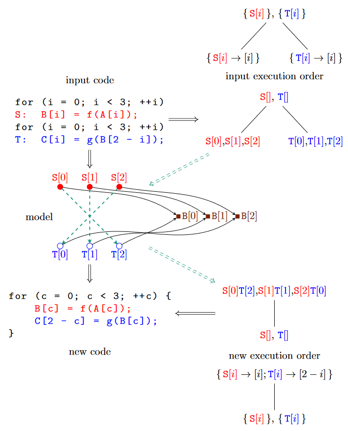

# introduce
该教程主要提供给想学习polyhedral编译的读者。主要关注概念和涉及到的操作，以及如何使用这些概念和操作完成基本的任务。在定义polyhedral编译的核心概念有一些变化。本文使用的工具是`isl`，比如`PPCG`。然而，其它常见变体(variation)也会在这里被涉及到，用来帮助读者理解ployhedral编译的理论。这些变体(variation)会被放在Alternatives部分,对isl专业术语（terminology)感兴趣的读者可能会跳过此部分。尽管本文尽量覆盖polyhedral编译技术的大部分主题，但是本文依旧有一些偏颇
(biased)以及本文从未声明是完善的。事实上，当前的初步版本是非常不完善的。

## 1.1 Polyhedral Compilation

从广义上来说，polyhedral编译技术（以后称为多面体编译）是一个程序分析和编译技术的合集，这些技术可以推断程序中的各个“动态执行实例”(dynamic excution instances)以及这些实例对之间的关系。一个动态执行实例是指一个操作(operation)或者一组操作在运行时执行，而不是这些操作在程序代码中出现的样子。
例如，一个语句(statement)出现在一个循环的程序当中，那么随着循环的迭代，会有很多个实例(instance)产生。因为在程序中可能有很多，甚至无限多的这样的实例(instances)，因此通常使用polyhedra模型和Presburger公式等数学模型来对其进行描述。更多的细节在第三章的 Presburger Sets and Relations描述。注意，在polyhedral编译中使用ployhedra不是必须，因为有可能在没有polyhedra（以后称为多面体）的情况下执行多面体编译，并且在多面体编译之外还有一些技术，比如abstract interpretation和array region analysis，也可以使用多面体。
下面的例子提供了一些在本教程中将要做的内容。该例子仅展示使用多面体编译的一个例子。


**Example 1.1**
考虑图1.1左上角部分的代码段。这是一个非常简短的两个循环的代码段，每个循环包含了一个语句。在这个例子当中，“动态执行实例”就是这两个语句。每个语句执行三次，每次循环迭代时执行一次。
每个语句实例使用label(S或者T)和一个整数来标识。在这个例子当中，整数等价于当实例执行时循环迭代的变化量。
在代码右侧的的树结构表示了语句实例（statement instances)的执行顺序。该树有两种形式，一种时紧凑的在图的最上面，下面的一种（非正式的）是扩展型的（extensional）。首先考虑扩展型。其根节点表示所有`S`语句的实例先于所有`T`语句的实例执行。根节点的孩子分别表示`S`和`T`语句的执行顺序。特别的，`S[0]`的执行顺序会比`S[1]`的执行顺序靠前，`S[1]`又在`S[2]`之前执行。
最后，这个树表示的语句实例按照如下顺序执行:`S[0],S[1],S[2],T[0],T[1],T[2]`，但是这种执行顺序是一种更结构化的方法，与输入代码的控制相匹配。特别的，根节点与两个循环语句的外部序列相关联，而叶子节点对应于for循环。图片最上方的紧凑型的树结构对循环信息提供了一个更抽象的表达。这种表达不是显示的列出`S`语句实例并按照它们执行顺序的，而是根据标识整数i的递增值执行实例，在本例中，i对应于循环的迭代器的值。树的概念会在第二章 Set of Named Integer Tuples中解释。
代码下面的图描述了各个语句实例以及代码段访问的B数组元素。在每个语句实例和每个被语句实例访问的数组元素元素之间有一个箭头。例如，语句实例`S[2]`通过对数组`B[i]`的引用，向数组元素`B[2]`写入。类似的，语句实例`T[0]`通过对相同数组`B[2-i]`的引用，从而向`T[0]`读取数据。
现在假设我们想要改变语句实例的执行顺序。语句实例的执行顺序很多种选择。事实上，有6个语句实例，那么就是6!=720中不同的顺序。如果允许同时执行一组语句实例，那么有更多的可能性。但是只有部分执行顺序能够保证原始程序的语义信息。比如，将`T[0]`放在`S[2]`之前将无法保证程序的语义信息，因为`T[0]`会在`S[2]`写`B[2]`之前读取`B[2]`，因此读取的值可能与原始程序中想要读取的值不同。总之，`T[0]`需要在`S[2]`之后执行。在图中，表示为一个虚线箭头，从`S[2]`指向`T[0]`。这种顺序约束是由两个部分决定的，一个是访问相同的内存元素，另一个是根据输入执行顺序比如`S[2]`要比`T[0]`先执行。计算顺序的约束在第六章中的Dependence Analysis部分介绍。
一个能够保证程序语义信息的可能执行顺序如图中的右下角。作为一个输入执行的顺序，一个新的执行顺序也是能表达一个扩展式（上方）和一个紧凑方式（下方）。在这个例子中，树的根节点首先根据这些语句实例的标识整数（可以理解成迭代下标）来进行排序，其中实例`S`的实例`i`将与实例`2-i`放在一个“组”进行执行。叶子节点规定了“组”中`S`实例要在`T`实例之前执行。最后这个树表示的语句实例执行顺序如下：`S[0],T[2],S[1],T[1],S[2],T[0]`。树左侧的代码展示这个执行顺序。

## 1.2 工具
这部分描述了在本教程当中用来展示概念和讨论所使用的工具。所有示例的数据都可以在本教材的电子版中找到。可以通过示例旁侧提到的文件名找到。本教程中所涉及的附件依赖与PDF浏览器。输出信息通过`barvinok-0.39`生成。

### 1.2.1 pet
使用C语言用于提取（部分）多面体模型的库（第五章 Polyhedral Model）。默认情况下，如果一个代码片段使用`#pragma scop`和`#pragma endscop`括起来，多面体模型会这段代码中提取。如果使用
`--autodetect`循环，那么`pet`将会搜索合适的代码片段来提取多面体模型，但是这样做会在每个函数体中最多检测一个这样的代码片段。当使用`pet`作为工具时，例如下面的`iscc`，通常不需要单独编译`pet`。

### 1.2.2 iscc
iscc 是一个用来操作命名整数元素集合（sets of named integer tuples）和与`barvinok`布置相关对象的一个交互式工具。（在第二章 Sets of Named Integer Tuples）每个命令使用另个或多个操作对目标进行控制，并以分号作为结束标志。这种操作的计算顺序为从左到右。这意味着没有操作优先级的说法。然而，计算顺序可以通过在子表达式周围添加括号来改变计算顺序。最后的结果计算顺序会被使用`:=`赋值到`issc`变量。为了避免与运算符名字存在潜在的冲突，最好只是用大写字母开头的变量名。
`iscc`变量时动态类型。`typeof`操作可以用来查询赋值给一个变量的值的类型。
如果计算结果没有赋值给一个变量，那么这个计算结果会被打印出出来。在交互模式下，打印的结果也会被赋值给一个有编号的变量，这个变量可以在后面的计算中重新使用，就像一个命名了的变量一样。
可以通过使用`print`操作来阻止赋值行为。本教程中的输出全部使用非交互模式，所以不包含任何任何对标号变量的赋值。例如，`iscc`使用文件读取输入信息。文件中命令可以在交互模式模式下通过`source operator`来执行。该操作(operator)使用一个文件名（一个使用双引号括起来的字符串）作为参数，并执行相应文件中的命令。
部分操作(operations)返回的一个列表的值（a list of values)。可以通过在返回列表的表达式后面加上 [、从零开始的索引和 ] 来提取此类列表中的元素。`issc`的操作会在后面逐步介绍。一个整数值后面可以跟着如下的操作符：加、减、乘。一个布尔类型的值可以跟着如下的操作符：分离（用'+'表示）和连接（用'*'表示）。

**Example 1.2** 下面的代码包含两个命令。第一个命令的结果赋值给一个变量，因此不会产生打印信息。第二个指令没有赋值给一个变量，因此会得到一个打印。
```cpp
A := 2 * ( 1 + 3);
A * A
```
输出结果为：
```cpp
64
```
只有在`iscc` 中内置了对 `pet` 的支持时，`parse_file` 操作才可用。需要传递参数`--with-pet=bundled`到`configure`当中。这里`iscc`自动启动`pet`的自动检测。使用`--no-pet-autodetect`选项关闭。

### 1.2.3 Python接口
isl、pet 和 barvinok 中的每一个都带有一个 python 接口，其中 pet 版本与 isl 版本基本相同，而 barvinok 版本是 pet 版本的扩展版本。特别是，barvinok 版本还包含由 barvinok 库定义的函数的接口。这三个都称为 isl.py。 它们包含在各自的发行版中，但只有在使用 `--with-clang` 和/或 `--with-clang-prefix` 选项明确告诉 configure 去哪里找到 clang 时，才能（重新）构建它们。要实际构建接口，对于 isl 版本使用 (cd interface; make isl.py)，对于 pet 和 barvinok 版本使用 make isl.py。 python接口不是自动安装的，所以你通常需要调整你的PYTHONPATH指向isl构建树的interface子目录或者pet或barvinok的构建树。 您可能还需要调整 LD_LIBRARY_PATH 以指向安装 libisl.so、libpet.so 或 libbarvinok.so 的目录。 此外，您需要使用 `--enable-shared-barvinok` 选项配置 barvinok，以便首先构建 libbarvinok.so。 第 13 页的示例 2.7 中显示了如何使用 python 接口的简单说明。
python 接口中类的名称是通过删除 isl_ 前缀从对应的 isl 派生而来的。 由于类包含在 isl 模块中，这意味着在实践中，第一个下划线需要用句点替换。 方法的名称通过删除类型名称前缀从相应的 isl 函数名称派生而来。 isl 中的一些函数名称有一个后缀，表示最终参数的类型。 这些后缀也从方法名称中删除。
pet 发行版还包含一个名为 pet.py 的 Python 接口。 它基于 isl.py，需要来自 pet 或 barvinok 的版本。默认情况下，pet 的 python 接口不会打开自动检测选项。