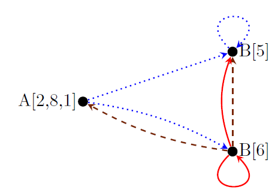
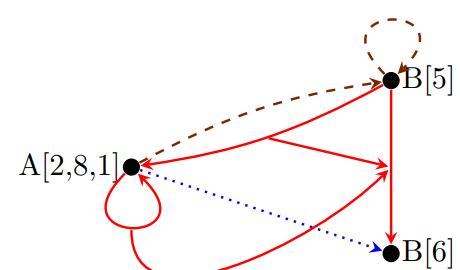

# Set of Name Integer Tuples
本章描述了本教程后面用于表示各种实体的抽象元素、这些元素的集合和二元关系以及对这些集合和关系的操作。 为了使对多面体编译不感兴趣的读者能够理解本章，我们对这些概念进行了纯粹抽象的处理。 此外，本章中的所有集合都将进行宽泛的描述。 详细描述在第 3 章 Presburger 集合和关系的主题。

## 2.1 Named Integer Tuples
本教程中考虑的对象每个都由一个命名的整数元组(named integer tuple)表示，由一个标识符（名称）和一个整数值序列组成。标识符可以省略，整数序列的长度可以为零。 如果两个这样的命名整数元组具有相同的标识符和相同的整数值序列，则它们被认为是相同的。

### Notation 2.1 (Named Integer Tuple)
命名整数元组（Named Integer Tuple）的符号由标识符组成，后跟以逗号分隔的方括号中的整数值列表。例如，没有标识符且具有零长度整数序列的“命名”整数元组写成`[]`。 具有标识符 A 和整数序列 2、8 和 1 的命名整数元组写成`A[2, 8, 1]`。 命名整数元组将扩展为第 28 页定义 2.66 中的结构化命名整数元组。

### Alternative 2.2 (Unnamed Integer Tuples)
一些框架只处理整数序列，不支持显式标识符(explicit indentifier)。 为了防止在概念上存在不同类型的此类序列的情况，通常通过添加在序列开头或结尾的附加整数值对不同类型进行编码。例如，如果 A 被赋值为 0，那么上面命名的元组可以表示为`[0, 2, 8, 1]`。

## 2.2 Sets
一组命名整数元组包含零个或多个命名整数元组作为元素。

### Notation 2.3 (Set)
集合的表示法由用大括号括起来的以分号分隔的元素列表构成。集合中的元素没有定义顺序。 这尤其意味着，一个集合中的元素可能以与定义它的顺序不同的顺序打印。 集合中的元素不能重复。 也就是说，一个元素要么属于一个集合，要么不属于一个集合，但它不能多次属于该集合。例如下面集合
`{[]; A[2, 8, 1]}`与集合`{A[2, 8, 1];[];[]}`是等价的。
在isl中，这样的集合表示为一个`isl_union_set`。空集写成`{}`或者`φ`，在iscc中写成`{}`。在isl中，空寂可以使用`isl_union_set_empty`来创建。

### Alternative 2.4 （Fixed-dimensional Sets)
一些框架不允许将不同大小的整数元组组合到同一个集合中。然后通常用任意整数值（例如，零）填充较小大小的元组。例如，如果`A[2, 8, 1]`被编码为`[0, 2, 8, 1]`，如 Alternative 2.2 Unnamed Integer Tuples 中那样，并且如果该元素需要与`B[5]`在同一个集合中组合，则后者可以编码为`[1, 5, 0, 0]`，假设 `B` 由值 1 表示。

### 2.2.1 Basic Operations
最基本的操作是交集、并集和集差。

### Operation 2.5 (Intersection of Sets)
两个集合 A 和 B 的交集 `A ∩ B` 包含同时包含在 A 和 B 中的元素。
在 isl 中，此操作称为`isl_union_set_intersect`。在 iscc 中，这操作写成`*`。

### Example 2.6 
iscc input
```python
{ B [0]; A [2 ,8 ,1] } * { A [2 ,8 ,1]; C [5] };
```
iscc output
```python
{ A [2 , 8 , 1] }
```

### Example 2.7  
使用 python 接口可以获得与示例 2.6 相同的结果，如下所示。
```python
import isl
s1 = isl.union_set ( " { B [0]; A [2 ,8 ,1] } " )
s2 = isl.union_set ( " { A [2 ,8 ,1]; C [5] } " )
print s1.intersect ( s2 )

```
输出为：
```python
{ A [2 , 8 , 1] }
```

### Operation 2.8 (Union of Sets)
两个集合 A 和 B 的并集 `A∪` 包含 A 或 B 中包含的元素。
在isl，这个操作可以调用`isl_union_set_union`。在iscc中，该操作写作`+`。

### Example 2.9
```python
{ B [0]; A [2 ,8 ,1] } + { A [2 ,8 ,1]; C [5] };
```
输出为：
```python
{ C [5]; B [0]; A [2 , 8 , 1] }
```
请注意，由于集合中的元素没有定义顺序，因此union中的元素可能会以不同的顺序打印在屏幕上。

### 2.10 （Set Difference)
两个集合 A 和 B 的差 `A \ B` 包含 A 中包含但 B 中不包含的元素。
在isl中，该操作调用`isl_union_set_substrace`。在iscc中，该操作写为`-`。


### 2.11
iscc的输入为
```python
{ B [0]; A [2 ,8 ,1] } - { A [2 ,8 ,1]; C [5] };
```
iscc的输出为
```python
{B[0]}
```

### 2.2.2 Comparisons

集合上最基本的运算时集合相等的运算判断。

### 2.12 (Equality of Sets)
两个集合$A$和$B$相同(A = B)，如果两个集合包含相同的元素。
在`isl`中，该操作写作`isl_union_set_is_equal`。在`iscc`中，该操作使用符号`=`。见Operation 3.26。

### Example 2.13 
```python
{ []; A[2 ,8 ,1] } = { A[2 ,8 ,1]; []; [] };
```
输出结果为
```python
True
```

### Example 2.14
使用python的接口如下
```python
import isl
s1 = isl.union_set ("{ []; A[2 ,8 ,1] }")
s2 = isl.union_set ("{ A[2 ,8 ,1]; []; [] }")
print s1.is_equal (s2)
```
输出为:

```python
True
```

判断集合是否为空

### Operation 2.15 (Emptiness of a Set)
集合为空的条件时不包含任何元素。
在`isl`中使用`isl_union_set_is_empty`表示。

### Example 2.16
bla bla

### Operation 2.17 (Subset)
bla bla

### Example 2.18
bla bla

### Operation 2.19 (Strict Subset)
bla bla

### Example 2.20
bla bla

### Operation 2.21 (Superset)
bla bla

### Operation 2.22 (Strict Superset)
bla bla

## 2.3 Binary Relations
二元关系时一个集合，集合中包含了一堆命名整数元组对。

### Notation 2.23 (Pair of Elements)
在`isl`中，两个命名的整数元组在每一对二元关系中使用`->`分隔。

注意该符号并不意味着第一个元组和第二个元组之间存在一个函数依赖的关系。也就是说，某第一个元组会出现在多个数对中，该数对中的第二个元组各不相同。
事实上，一个二元关系可以看成时一个图上的边。这个图里面可能会有环（loops），但是没有重边（parallel edge，应该翻译成multiple edges）。

### Example 2.24
```python
{ A[2; 8; 1] -> B[5]; A[2; 8; 1] -> B[6]; B[5] -> B[5]}
```
在`isl`当中，这样的二元关系表示成`isl_union_map`。空的二元关系使用`{}`表示或者$\phi$表示，在`iscc`中使用`{}`表示。在`isl`中，一个空的二元关系使用`isl_union_map_empty`。
注意，尽管二元关系本质上以元组对的集合，但是在`isl`当中集合与二元关系存在严格的界限。即，集合只能包含元组（没有元组对），二元关系只能包含元组对（不能包含元组本身）。

### Alternative 2.25 (Encoding Binary Relations)
bla bla

### 2.31 Basic Operations
因为二元关系本质上是元组对的集合，在集合上可以进行的操作同样可以在二元关系上使用。二元关系允许一个取逆（inverse）和一个组合（composition）操作。

### Operation 2.26 (Intersection of Binary Relations)
两个二元关系A和B的交集$A \cap B$的结果是既包含在集合A中且包含在集合B中的元组对。
在`isl`中该操作为`isl_union_map_intersect`，在`iscc`中，该操作使用`*`表示。

### Exmaple 2.27
```python
{ A[2 ,8 ,1] -> B [5]; B[5] -> B[5] } * { A[2 ,8 ,1] -> B [6]; B[5] -> B[5] };
```
输出为
```python
{ B[5] -> B[5] }
```

### Operation 2.28 (Union of Binary Relations)
二元关系集合A和B的并集$A \cup B$的结果为包含在A或者包含在B中的元组对。
在`isl`中，该操作写作`isl_union_map_union`，在`iscc`中，该操作写作`+`。

### Operation 2.29 (Binary relation Difference)
bla bla

### Operation 2.30 (Inverse of a Binary Relation)
对一个二元关系R取逆的操作$R^{-1}$是将包含在二元关系R中的元组的映射顺序调转。

$R^{-1} = \{j -> i : i -> j \in R \}$

在`isl`中该操作记为`isl_union_map_reverse`。在`iscc`中，该操作记作`^-1`

### Example 2.31
bla bla

### Operation 2.32 (Composition of Binary Relations)
两个二元关系A和B的组合$B \circ A$的结果为二元关系的第一个元素来自于A，第二个元组来自于B。

$B \circ A = \{i -> j : \exist k : i -> k \in A \land k -> j \in B\}$
在`isl`中，该操作写作`isl_union_map_apply_range`，参数为A和B。在`iscc`中，该操作写作`before`或者`.`，参数为A和B;或者调转擦拭你，使用`after`或者`()`表示，比如$B(A)$。

### Example 2.33
考虑如下关系
$A = \{ B[6] -> A[2; 8; 1]; B[6] -> B[5] \}$

$B = \{ A[2; 8; 1] -> B[5]; A[2; 8; 1] -> B[6]; B[5] -> B[5] \}$
那么

$B \circ A = \{ B[6] -> B[6]; B[6] -> B[5] \}$



图2.2表示了二元关系的组合，其中褐色虚线为二元关系A，蓝色点线为二元关系B，红色实线为组合后的二元关系结果。

如果反转A和B的调用顺序，结果是不同的：

$A \circ B = \{A[2; 8; 1] -> B[5]; A[2; 8; 1] -> A[2; 8; 1] \}$

iscc 的输入为:
```python
A := { B[6] -> A[2 ,8 ,1]; B[6] -> B[5] };
B := { A[2 ,8 ,1] -> B [5]; A[2 ,8 ,1] -> B [6]; B[5] -> B[5] };
B after A;
A after B;
```
输出
```python
{ B[6] -> B [6]; B[6] -> B[5] }
{ A[2, 8, 1] -> B [5]; A[2, 8, 1] -> A[2, 8, 1] }
```

一个二元关系R与自身的的组合R(R)可以写成$R^2$。类似的，$R^{-2}$表示R对于本身的逆的组合。推广后，对于一个二元关系的固定次幂的定义如下。

### Operation 2.34 (Fixed Power of a Binary Relation)
bla bla

### Example 2.35
bla bla

### Example 2.36
bla bla

### 2.3.2 Comparisons
能够在集合上进行的比较运算也可放在二元关系上。

### Operation 2.37 (Equality of Binary Relations)
二元关系 A和 B相等(A = B) 如果他们包含相同的元素对。

在`isl`当中，该操作称为`isl_union_map_is_equal`。在`iscc`当中，该操作写作`=`。可见Operation 3.30

### Operation 2.38 (Emptiness of a Binary Relation)
如果一个二元关系不包含任何元素，那么它是空的，比如它和一个空的二元关系等价。

在`isl`中，该操作为`isl_union_map_is_empty`。在`iscc`当中，该操作可以通过与一个空的二元关系比较来实现，可以看Operation 3.33。

### Operation 2.39 (subrelation)
bla bla

### Operation 2.40 (Strict Subrelation)
bla bla

### Operation 2.41 (Superrelation)
bla bla

### Operation 2.42 (Strict Superrelation)
bla bla

### 2.3.3 Conversions
本小节描述如何从集合或其它的方法来构建二元关系的操作。

### Operation 2.43 (Domain of a Binary Relation)
二元关系R的domain 用$dom\ R$表示，domain中的元素为二元关系中，元素对的所有第一个元素。即

$dom\ R = \{i :\exist j : i -> j \in R \}$

在`isl`中，该操作称为`isl_union_map_domain`。在`iscc`中，该操作写作`dom`或者`domain`。

### Example 2.44
考虑Example 2.24的集合，其domain为
$\{A[2, 8, 1]; B[5] \}$

*iscc的例子略过*

### Operation 2.45 (Range of a Binary Relation)
一个二元关系R的range包括所有二元关系R中元素对的第二个元素。即

$ran\ R = \{j : \exist i : i>j \ in R\}$

在`isl`当中，该操作写作`isl_union_map_range`。在`iscc`中写作`ran`或者`range`。

### Example 2.46
bla bla

### Operation 2.47 (Universal Binary Relation between Sets)
泛化关系（universal relation) 在两个集合A上的二元关系$A -> B$包含的元素对，其中第一个元素来自A，第二个元素来自B。

$A \rightarrow B = \{i -> j : i \in A \land j \in B\}$

在`isl`当中，该操作写作`isl_union_map_from_domain_and_range`，在`iscc`当中，该操作写作`->`。

### Exmaple 2.48
bla bla

### Operation 2.49 (Identity Relation on a Set)
bla bla

### Example 2.50
bla bla


### 2.3.4 Mixed Operations
本节描述一些组合二元关系和集合之间的操作

### Operation 2.51 (DOmain Restriction)
一个关于集合S的二元关系R的domain restriction表示为$R \cap_{dom}S$，要求二元关系R中的第一个元素在集合S当中。即：

$R \cap_{dom}S = R \cap (S ->(ran\ R))$

在`isl`中标识为`isl_union_map_intersect_domain`。在`iscc`中该操作写作`*`。

### Exmaple 2.52
```python
R := { A[2 ,8 ,1] -> B [5]; A[2 ,8 ,1] -> B [6]; B[5] -> B[5] };
S := { A[2 ,8 ,1]; C[5] };
R * S;
```
输出为：
```python
{ A[2, 8, 1] -> B [6]; A[2, 8, 1] -> B[5] }
```

### Operation 2.53 (Range Restriction)
一个关于集合S的二元关系R的range restriction $R \cap_{ran}S$，要求二元关系的第二个元素在集合S当中，即

$R \cap_{ran}S = R \cap ((dom\ R)->S$

在`isl`中标识为`isl_union_map_intersect_range`，在`iscc`中表示为`->*`。

### Example 2.54
```python
R := { A[2 ,8 ,1] -> B [5]; A[2 ,8 ,1] -> B [6]; B[5] -> B[5] };
S := { A[2 ,8 ,1]; B[5] };
R ->* S;
```
输出为：

```python
{ A[2, 8, 1] -> B [5]; B[5] -> B[5] }
```

### Operation 2.55 (Domain Subtraction)
bla bla

### Example 2.56
bla bla

### Operation 2.57 (Range Subtraction)
bla bla

### Example 2.58
bla bla

### Operation 2.59 (Application)
bla bla

### Exmaple 2.60
bla bla

### 2.3.5 Properties
虽然一个二元关系不一定表示（单值）函数，但是有些二元关系很可能是单值的。下面操作检查这个性质。

### Operation 2.61 (Single-valued)
bla bla

### Example 2.62
bla bla

### Operation 2.63 (Injective)
bla bla

### Example 2.64
bla bla

### Operation 2.65 (Bijective)
bla bla


## 2.4 Wrapped Relations
虽然集合以命名整数元组表示，而二元关系以此类元组对表示，但有时使用两个以上此类元组之间的关系来表示会很方便。isl 目前不支持三元或一般 n 元关系。但是，它确实允许将一对元组组合成一个元组，然后该元组可以再次作为一对元组中的第一个或第二个元组出现。 这个过程称为“包装”（wrapped）。 包装一对命名整数元组的结果称为结构化命名整数元组（Structured named integer tuple)。


### 2.4.1 Structured Named Integer Tuples
### Definition 2.66 (Structured Named Integer Tuple)
一个结构化命名元组只能表示成如下两种形式：

1. 一个命名整数元组表示为，一个标识符n，带有一个整数$i_j$满足$0≤j＜d$，且$d≥0$，写作$n[i_0, i_1,...,i_{d-1}]$
2. 一个命名的结构化命名整数元组对表示为，一个标识符n，带有两个结构化命名整数元组i和j，写作$n[i->j]$

---
*就是对Named Integer Tuple进行一次抽象，Named Integer Tuple中的内容也可以是Named Integer Tuple*

*集合中的内容可以是集合或者是二元关系，二元关系的映射可以嵌套二元关系以及集合*


### Example 2.67 
下面的例子就是结构化命名整数元组的集合:
```python
{ B[5]; S[B[6] -> A[2, 8, 1]]; Q[B[5] -> S[B[6] -> A[2, 8, 1]]] }
```
下面的例子是使用结构化命名整数元组的二元关系：
```python
{ B[5] -> A[2, 8, 1]; S[B[6] -> A[2, 8, 1]] -> B[5] }
```

从这一点开始，集合将被认为包含结构化命名整数元组，而不仅仅是命名整数元组，并且二元关系将被认为包含结构化命名整数元组对。 事实上，命名整数元组的概念本身将被认为还包括结构化命名整数元组。 但是，和以前一样，集合不能包含一对元组，二元关系不能包含单个元组。
放在一起考虑共享相同结构 和(或)标识符的元素组会很方便。 为此，定义了以下概念。

### Definition 2.68 (Space)
结构化命名整数元组$i$的空间（Space)$S_i$定义如下：

1. n/d，如果$i$的形式为$n[i_0,i_1,...,i_{d_1}]$，一个标识符n以及一个非负整数d
2. $(n, S(j), S(k)),如果i的形式是$n[j->k]$，其中n是一个标识符，并且j和k分别为结构化命名整数元组。

一对结构化命名整数元组$i->j$的空间为$(S(i), S(j))$
### Example 2.69
元组$Q[B[5] -> S[B[6] -> A[2, 8, 1]]]$的空间为：
$(Q, B/1, (S, B/1, A/3))$

同样，整数值可以从结构化命名整数元组当中提取出来。
*B/1应该表示集合B中有一个元素*

### Definition 2.70 (Value Vector)
值向量$V_i$的结构化命名整数元组$i$的表示形式如下两种：
1. (i_0,i_1,...,i_{d-1})，如果$i$的形式是$n[i_0,i_1,...,i_{d-1}]$, n是标识符且d是一个非负整数
2. $V(j)||V(k)$，$||$表示连接两个向量，如果$i$的形式$n[j->k]$，其中n是一个标识符，且j和k是结构化命名整数元组。结构化命名整数元组对的值向量$i->j$的表示为$V(i)||V(j)$。


### Example 2.71
$Q[B[5] -> S[B[6] -> A[2, 8, 1]]]$的值向量为$(5,6,2,8,1)$

### 2.4.2 Wrapping and Unwrapping
### Example 2.72 (Wrap)
一个二元关系R的wrap操作(简称WR)就是对R中每一对元素的的一个匿名wrap拷贝。表示如下:
$WR = \{ [i → j] : i -> j \in R \}$

在isl中该操作叫做`isl_union_map_wrap`，在iscc中，该操作写作`wrap`。

### Example 2.73

输入为：
```python
wrap { A [2 ,8 ,1] -> B [5]; A [2 ,8 ,1] -> B [6]; B [5] -> B [5] };
```
输出为：
```python
{ [ A [2 , 8 , 1] -> B [6]]; [ A [2 , 8 , 1] -> B [5]]; [ B [5] -> B [5]] }
```
*就是给所有元素都套上一个[]*

### Operation 2.74 (UnWrap)
一个集合S的unwrap表示为$W^{-1}S$, 是一个二元关系,集合S包含了被wrap的副本的元素对，写作:
$W^{−1}S = \{ i -> j : \exist n : n[i -> j] \in S \}$
在isl，该操作写作`isl_union_set_unwrap`

### Example 2.75 
iscc输入为
```python
S := { B [5]; S [ B [6] -> A [2 , 8 , 1]]; Q [ B [5] -> S [ B [6] -> A [2 , 8 , 1]]] };
unwrap S ;
```
iscc输出为
```python
{ B [6] -> A [2 , 8 , 1]; B [5] -> S [ B [6] -> A [2 , 8 , 1]] }
```

当R为是一个二元关系，如果有$W^{-1}WR$,那么结果与$R$相同。但是当S是一个集合，如果对S操作$WW^{-1}S$，结果不一定是$S$。比如，当S中包含的元素没有被wrapped元素对，那么这些元素会被从集合中去掉。此外，如果任意的被wrapped的元素对有一个标识符(identifier),那么这个标识符也会被去掉。

### Example 2.76 
iscc输入为：
```python
S := { B [5]; S [ B [6] -> A [2 , 8 , 1]];
Q [ B [5] -> S [ B [6] -> A [2 , 8 , 1]]] };
wrap ( unwrap S );
```
iscc输出为：
```python
{ [ B [6] -> A [2 , 8 , 1]]; [ B [5] -> S [ B [6] -> A [2 , 8 , 1]]] }
```
*可以看到经过wrap和unwrap操作后，B[5]不见了，标识符S和Q没了*

### 2.4.3 Products
两个集合（或二元关系）的乘积是将其参数中的元组组合成wrapped关系的集合（或二元关系）。 在二元关系的情况下，也可以只组合域(domain)或范围(range)。

### Operation 2.77 (Set Product)
集合A和B的乘积$A×B$的表示是一个集合，该集合当中包含包含一堆wrapped的元素对，这些元素对的第一个元素来自A，第二个元素来自B。那么，两个集合的乘积就是两个集合一般关系之间的wrap。如下:
$A × B = W(A → B) = { [i → j] : i ∈ A ∧ j ∈ B }$

在isl中，该操作的函数为`isl_union_set_product`。在iscc中，该操作写为`cross`。


### Exmaple 2.78 
对比23页的例子2.48，iscc的代码如下：
```python
S := { A [2 ,8 ,1]; B [5] };
T := { A [2 ,8 ,1]; B [6] };
S cross T ;
```
输出结果为：
```python
{ [ A [2 , 8 , 1] -> A [2 , 8 , 1]]; [ A [2 , 8 , 1] -> B [6]]; [ B [5] ->  A [2 , 8 , 1]]; [ B [5] -> B [6]] }
```

### Operator 2.79 (Binary Relation Product)
二元关系A和B的乘积$A×B$的表示是一个二元关系，该二元关系当中包含包含一堆wrapped的元素对，这些元素对的第一个元素来自A，第二个元素来自B。
表示为：
$A × B = { [i -> m] -> [j -> n] : i -> j \in A \land m -> n \in B }$
在isl当中，该操作记为：`isl_union_map_product`。在iscc中，该操作写作`cross`。
如下面图2.4所示

棕色虚线和蓝色点线表示Example 2.80中A和B图的二元关系，公式下以A和B的`range`做乘积的二元关系结果如图红色实线所示。


bla bla


### 2.4.4 Domain and Range Projection
下面的操作以一个二元关系作为输入，并且产生一个新的二元关系，这个二元关系将输入的wrapped副本投影（projects)到其域（domain)或范围(range)。

### Operation 2.100 (Domain Projection)
一个二元关系$R$的domain projection $\xrightarrow{dom}R$也是一个二元关系，该关系为R中的每对元素，经过domain project后得到的结果为一个R中wrapped元素对并指向这个元素对的第一个元素。如下：
$\xrightarrow{dom}R = { [i -> j] -> i : i -> j \in R }$

在isl中，该操作记为`isl_union_map_domain_map`，也可以参考4.2节的Creation。在iscc中，该操作写为`domain_map`。

### Example 2.101 
iscc的输入为：
```python
R := { A [2 ,8 ,1] -> B [5]; A [2 ,8 ,1] -> B [6]; B [5] -> B [5] };
domain_map R ;
```
iscc的结果为：
```python
{ [ A [2 , 8 , 1] -> B [6]] -> A [2 , 8 , 1]; [ A [2 , 8 , 1] -> B [5]] -> A [2 , 8 , 1]; [ B [5] -> B [5]] -> B [5] }
```

### Operation 2.102 (Range Projection)
一个二元关系$R$的range projection $\xrightarrow{ran}R$也是一个二元关系，该关系为R中的每对元素，经过range project后得到的结果为一个R中wrapped元素对并指向这个元素对的第二个元素。
如下：
$\xrightarrow{ran}R = { [i → j] → j : i → j ∈ R }$

在isl中，该操作为表示为`isl_union_map_range_map`。在iscc中，这个操作为`range_map`。

### Example 2.103
iscc的输入：
```python
R := { A [2 ,8 ,1] -> B [5]; A [2 ,8 ,1] -> B [6]; B [5] -> B [5] };
range_map R ;
```
iscc的输出：
```python
{ [ A [2 , 8 , 1] -> B [6]] -> B [6]; [ A [2 , 8 , 1] -> B [5]] -> B[5]; [ B [5] -> B [5]] -> B [5] }
```