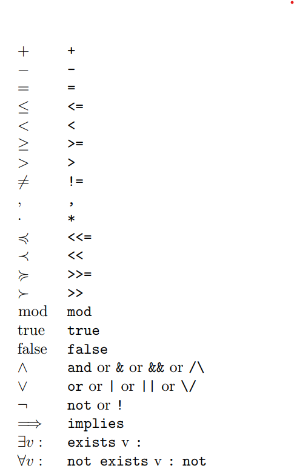

# Presburger Sets and Relations
在前一章中，通过明确列出包含在集合或二元关系中的（成对的）元素，对集合和二元关系进行了扩展描述。 本章解释了如何通过元素（对）需要满足的属性来内涵地描述集合和二元关系。 和前一章一样，集合和关系将继续被纯粹抽象地处理。

## 3.1 Intensional Descriptions
在内涵描述(internsional descriptions)中，集合的元素是根据结构化的命名整数元组模板(structured named integer tuple templates)来描述的。 这些本质上与结构化命名整数元组( structured named integer tuples)相同，只是整数已被变量替换。 将以下定义与第 28 页的定义 2.66、第 29 页的定义 2.68 和第 29 页的定义 2.70 进行比较。

### Definition 3.1 (Structured Named Integer Tuple Template)
一个结构化命名整数元组模板可能为如下两种情况之一：
1. 一个标识符n，以及变量$i_j$满足$0≤j<d$且$d≥0$，记为$n[i_0, i_1,...,i_{d-1}]$
2. 一个标识符n有两个结构化命名整数元组模板$i$和$j$，写为$n[i->j]$

### Definition 3.2 (space)
一个结构化命名整数元组模板$i$的空间$Si$有可能为如下两种情况之一：
1. n/d，如果$i$的形式为$n[i_0, i_1, i_2,...,i_{d-1}]$，n为一个标识符，d是一个非负整数。
2. (n, S(j), S(k))，如果i的形式是$n[j->k]$，且n是一个标识符，并且j和k是结构化命名整数元组模板.

结构化命名整数元组模板对$i->j$的空间表示为:$(S(i), S(j))$

### Definition 3.3 (Variable Vector)
变量向量$Vi$的结构化命名整数元组模板$i$是一个向量，有如下两种形式：
1. (i_0, i_1,...,i_{d-1}),如果$i$的形式是$n[i_0, i_1,...,i_{d-1}]$，其中n是标识符，并且d是一个非负整数
2. $V(j) || V(k)$，其中$||$表示concat两个向量，这里要求$i$的形式是$n[j->k]$，其中n是一个标识符，并且$j$和$k$是结构化命名整数元组模板。

一对结构化命名整数元组模板$i->j$的变量向量的形式是$V(i)||V(j)$。

现在根据上面的模板形式重新定义集合与二元关系。

### Notation 3.4 (Set)
集合的表示法由分号分隔的元素描述列表组成，该列表括在大括号中。 元素描述由一个模板组成，后跟一个冒号和一个根据模板中的变量的公式。*就是描述集合的范围*
在每个公式中，对应元组的变量向量的元素称为集合变量(set variables)。

### Notation 3.5 (Binary Relation)
二元关系的表示法由分号分隔的元素对描述列表形成，该列表括在大括号中。 元素对描述由一对模板组成，由箭头分隔，后跟冒号，以及根据模板对中的变量的公式。
一个整数元组$i$属于一个集合，当且仅当集合描述包含一个元素描述，使得元组模板与$i$具有相同的空间，并且$i$的值向量满足相应的公式。对于二元关系也是如此。公式的确切性质及其满足性（satisfaction)在第 3.2 节 Presburger 公式中进行了描述。


### Example 3.6
集合${B[i]:5 ≤ i ≤ 6; C[]:}$和与在第二章的集合命名整数元组的形式${B[5]; B[6]; C[]}等价$

## 3.2 Presburger Formulas
Presburger 公式是一阶公式概念的特定实例。 首先定义这个一般概念。

### Definition 3.7 (Language)
一个语言(language)的描述公式为:$L = {f_1/r_1, f_2/r_2,..., P_1/s_1, P_2/s_2,...}$
即，由函数符号$f_i$和谓词符号(predicate symbols)$P_i$组成的集合，其中$f_i$和$P_i$都带有一个属性元(arity)$r_i$或$s_i$，比如这些属性元表示$f_i$或$P_i$需要的参数。
一个函数带有0个属性元称之为常量。

### Definition 3.8 (Term)
在一个语言$L$中一个项(term)的表示有如下两种之一：
1. v, 一个变量v
2. $f_i(t_1,...,t_{ri})$，$L$中一个函数符号$f_i$，带有一个属性元$r_i$和$t_j$项，其中$1 ≤ j ≤ r_i$。特别的，如果$r_i=0$，那么$f_i()$就是一个项。

### Definition 3.9 (First Order Formula)
在一个语言$L$中一阶公式可以归纳为如下之一：
1. true （就是布尔量）
2. $P_i(t_i,...,t_{si})$，其中$P_i$是语言$L$中的一个谓词符号带有属性元$s_i$和项$t_j$，满足$1 ≤ j ≤ s_i$
3. $t_1 = t_2$，其中$t_1$和$t_2$是语言$L$中的项。
4. $F_1 \wedge F_2$，连接两个两个公式(formulas)$F_1$和$F_2$
5. $F_1 \vee F_2$，分离两个两个公式(formulas)$F_1$和$F_2$
6. $\neg F$，对公式$F$取反。
7. $\exists v : F$，公式$F$在变量$v$上存在量化(existential quantification)
8. $\forall v : F$，公式$F$在变量$V$的全称量化

*这里存在量化和全称量化是谓词逻辑(离散数学)中的术语,全称量化即表示一个谓词再所考虑的每一个对象中都为真；存在量化表示一个谓词对所考虑中的一个或多个对象为真。这里的谓词就是函数F*

参考[谓词逻辑](https://www.jianshu.com/p/fb371b50800c)

### Definition 3.10 (Free and Bound Variables)
*翻译成自由变量与绑定变量*
公式$F$中一个变量$v$当F是$\exists v : F_1$或者$\forall v : F_2$的子公式(subformula)并且$v$出现在$F_1$或者$F_2$当中，此时$v$称之为绑定变量。否则称之为自由变量。

### Definition 3.11 (Closed Formula)
*翻译成闭式公式*
当一个公式没有包含任何自由变量的时候，称之为闭式公式。

### Definition 3.12 (Presburger Language)
Presbugrger 语言是带有如下函数符号的一阶语言(first order language),满足如下：
1. +/2
2. -/2
3. 对于每个整数$d$都有一个常量符号$d/0$
4. 对于每个正整数$d$都有一个一元函数符号$\lfloor ·/d \rfloor$
5. 一组符号$c_i/0$的以及一个单个的谓词符号
6. ≤/2

*上面的+/2中，加号表示加法的谓词符号，这里理解成函数，后面的2是属性元，表示有两个参数，可以理解成加法op要有两个操作数组成*

### Definition 3.14 (Presburger Term)
Presburger term 是在Presburger 语言中的项。

### Definition 3.14 (Presburger Formula)
一个Presburger 公式是Presburger语言中的一阶公式

为了能够评估是否满足一阶公式，需要考虑讨论域和所有函数和谓词符号的解释。这里的讨论域（范围）是指公式中变量的一组值。演绎(interpretation)将函数或谓词符号映射到实际函数或谓词。
在Presburger 公式的例子中，讨论域就是整数集合。

*这里的interpretation应该是翻译成逻辑学中的演绎（演绎推理，或者逻辑推断），而不是解释吧*

### Definition 3.15 (Interpretation of Presburger Symbols)
对 Presburger 公式中的函数和谓词符号给出以下演绎。

1. 函数符号$+/2$会被映射到两个整数的加法函数。
2. 函数符号$-/2$会被映射到两个整数的减法函数，第一个数减去第二个。
3. 每个常量符号$d/0$会被映射到对应的整数值。
4. 每个函数符号$\lfloor ·/d \rfloor$会被映射到一个返回以$d$作为除数的整数除法函数结果
5. 谓词符号≤/2会被映射到一个整数集上的小于等于关系。

常数符号 $c_i$ 没有赋予固定的演绎。相反，考虑了所有可能的整数演绎。 Presburger 项的演绎是将演绎递归地应用于该项中出现的函数符号的结果。
以下定义根据讨论域（或范围）和符号的演绎定义了一般一阶公式的真值概念。该定义使用了$F\{v \longmapsto d\}$形式来表达，表示用$d$替换$F$中的每个任意出现的$v$的结果。

### Definition 3.16 (True Value)
在给定的范围和演绎下，第一类公式的真值表达如下：
1. 公式为true，结果就是true
2. 公式为$P_i(t_1,...,t_{si})$为真，如果$P_i$的演绎应用到$t_j$的演绎为真
3. 公式$t_1 = t_2$为真的情况是当$t_1$和$t_2$的演绎结果相同。
4. $F_1 \land F_2$为真，如果$F_1$与$F_2$为真。
5. $F_1 \lor F_2$为真，当$F_1$或者$F_2$为真。
6. $\neg F$ 为真，当$F$不为真时。
7. $\exists v : F(v)$为真，如果在讨论域中存在$d$使得$F\{v \longmapsto d\}$为真
8. $\forall v : F(v)$为真，如果在讨论域中所有$d$使得$F\{v \longmapsto d\}$为真

## 3.3 Presburger Set and Relation

### Definition 3.17 (Presburger Set)
Presburger Set是第42页Notation 3.4符号中的一个集合，其中公式是 Presburger 公式，如前页定义 3.14 中所述。 此公式中唯一允许的自由变量是元组模板的变量。

### Definition 3.18 (Presburger Relation)
Presburger 关系是第 42 页 Notation 3.5 的符号中的二元关系，其中公式是 Presburger 公式，如前一页的定义 3.14 中所述。 此公式中唯一允许的自由变量是一对元组模板的变量。

正如第 3.1 节内涵描述中已经解释的，整数元组$i$属于一个集合，当且仅当集合描述包含元素描述$t : F$使得元组模板具有与$i$相同的空间，即 $Si = St$，并且$i$的值向量满足对应的公式，比如
$F\{Vt \longmapsto Vi\}$为真。

### Example 3.19 
集合的例子
$\{[i]: 0 ≤ i \land i ≤ 10 \land \exists α: i = α + α\}$ 与集合 $\{[0];[2];[4];[6];[8];[10]\}$ 等价

### Exmaple 3.20 
$\{[i] : \forall i : 0 ≤ i \land i ≤ 10 \}$是空集，因为子公式$0 ≤ i \land i ≤ 10$为真的情况只有对部分$i$值有效，而不是所有$i$。这表示公式$\forall i : 0 ≤ i \land i ≤ 10 \}$为假，因此，没有元组变量 i 的值符合该公式。

*把“所有”改成“存在”应就对了*

如果元素描述中的公式包含任何常数符号，则公式的真值可能取决于对这些常数符号的解释。因此，Presburger 集本质上表示一组集合，每个集合代表常数符号的值。


### Example 3.21
考虑如下的 Presburger 集合

$\{S[i] : 0 ≤ i \land i ≤ n\}$
该集合的值依赖于常量符号$n$，该集合对应于如下集合的其中之一。
1. Φ if n ＜ 0
2. $\{S[0]\}$ if n = 0
3. $\{S[0]; S[1]\}$ if n = 1
4. $\{S[0]; S[1]; S[2]\}$ if n = 2
5. ...

表3.1 显示了第 43 页定义 3.9 的一阶逻辑连接词和第 43 页定义 3.12 的 Presburger 符号的 isl 符号，以及将在第 3.4 节语法糖中解释的一些语法糖。

*页码请对照原始pdf*

### Notation 3.22 (Constant Symbols)
在这部分文档当中，常量符号将会以roman 字体出现。在isl中，常量符号成为参数（parameter)。参数和变量的表示方式相同，但是参数需要在集合或者二元关系的描述之前就先声明好。尤其是，所有的参数需要放在一个逗号分隔的列表中，并用括号括起来，并且在集合或二元关系的描述前面加上一个 “$->$”。参数的顺序无关紧要。

### Example 3.23 
考虑例子3.21中的集合。在isl中的表示如下

$[n] -> \{S[i] : 0 ≤ i\ and\ i ≤ n\}$

在一些例子当中，对于一个非空的集合或关系，去判断限定它们的常量符号值会很方便。
这些集合关系可以用单元集合(unit set)来表示，该集合当中不包含任何元组，不过它根据常量符号的值来判断是否为空。
单元集的符号类似于第 42 页的符号 3.4 中的集合，除了它不包含任何元组模板。



### Notation 3.24 (Unit Set)
单元集合(unit set)由冒号和一个常量公式（依赖于常量符号的公式）组成，并使用括号括起来。

在isl中，单元集合称为参数集合（parameter sets），并且在isl中表示为 isl_set。

### Examples 3.25

Exmample 3.21中的集合非空条件可以描述为$\{ : n ≥ 0\}$
或者在isl中表示如下$[n] -> \{ : n >= 0 \}$

第 2 章命名整数元组集合中定义的大多数操作不受常量符号存在的影响。 该操作简单地统一应用于这些常量符号的所有可能值。 然而，一些操作，特别是比较操作，会受到影响。

### Operation 3.26 (Equality of Sets)
两个集合A和B相等(A = B)，如果它们对于常量符号的每个值都包含相同元素。

### Example 3.27
集合 $\{a[i] : i ≥ 0 \}$与集合$\{a[i] : i ≥ 0 \land n ≥ 0\}$不相同
因为第二个集合当n为负值的时候，集合是空的，而且第一个集合对于所有的n值包含无限多个元素。

在iscc中表示如下：

```python
A :=  [ n ] -> { A [ i ] : i >= 0 };
B := [ n ] -> { A [ i ] : i >= 0 and n >= 0 };
A = B
```

```python
False
```

### Example 3.28
集合 $\{a[i] : 0 ≤ i < n\}$ 与集合 $\{a[i] : 0 ≤ i < m\}$ 不相等，因为常量符号n和m不一定相同。

在iscc中如下：

```python
A := [ n ] -> { A [ i ] : 0 <= i < n };
B := [ m ] -> { A [ i ] : 0 <= i < m };
A = B ;
```

```python
False
```

### Example 3.29

集合$\{ a[n, i] : 0 ≤ i < n \}$与集合$\{ a[m, i] : 0 ≤ i < m \}$相等。因为两个集合包含相同的整数元组。

在iscc中如下：
```python
A := { A [n , i ] : 0 <= i < n };
B := { A [m , i ] : 0 <= i < m };
A = B ;
```
```python
True
```


*这里没明白，为什么3.28不相同，但是3.29相同。前面3.28的常量符号是作为参数出现的，但是在例子3.29当中常量符号没有作为参数出现，这里猜测如果没有出现常量符号参数，那么取值都相同*


### Operation 3.30 (Equality of Binary Relations)

两个二元关系 A 和 B相同（A == B）的条件是对于每个常量符号，它们都包含相同的元素对。

### Operation 3.31 (Emptiness of a Set)

一个集合为空的条件是对于任意的常量符号，它不包含任何元素。

### Example 3.32

如果Example 3.29中的集合A仅对常数n的某些值是空的，而不是所有值。因此集合A不是空集。

在iscc中
```python
[ n ] -> { A [ i ] : i >= 0 and n >= 0 } = { };
```
```python
False
```
*注意":="表示赋值，"="表示判断是否相等*

*这里原文是集合B应该是写错了*

### Operation 3.33 (Emptiness of a Binary Rlation)
如果二元关系不包含任何常量符号值的任何元素对，则该二元关系为空。


### Operation 3.34 (Subset)
集合 A 是集合 B 的子集，$A ⊆ B$，如果对于常数符号的每个值，A 的所有元素都包含在 B 中，即，如果 $A \backslash B = ∅$。

### Example 3.35
iscc输入
```python
A := [ n ] -> { A [ i ] : i >= 0 };
B := [ n ] -> { A [ i ] : i >= 0 and n >= 0 };
B <= A ;
```
```python
True
```