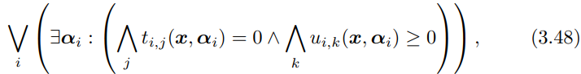

# Presburger Sets and Relations
在前一章中，通过明确列出包含在集合或二元关系中的（成对的）元素，对集合和二元关系进行了扩展描述。 本章解释了如何通过元素（对）需要满足的属性来内涵地描述集合和二元关系。 和前一章一样，集合和关系将继续被纯粹抽象地处理。

## 3.1 Intensional Descriptions
在内涵描述(internsional descriptions)中，集合的元素是根据结构化的命名整数元组模板(structured named integer tuple templates)来描述的。 这些本质上与结构化命名整数元组( structured named integer tuples)相同，只是整数已被变量替换。 将以下定义与第 28 页的定义 2.66、第 29 页的定义 2.68 和第 29 页的定义 2.70 进行比较。

### Definition 3.1 (Structured Named Integer Tuple Template)
一个结构化命名整数元组模板可能为如下两种情况之一：
1. 一个标识符n，以及变量$i_j$满足$0≤j<d$且$d≥0$，记为$n[i_0, i_1,...,i_{d-1}]$
2. 一个标识符n有两个结构化命名整数元组模板$i$和$j$，写为$n[i->j]$

### Definition 3.2 (space)
一个结构化命名整数元组模板$i$的空间$Si$有可能为如下两种情况之一：
1. n/d，如果$i$的形式为$n[i_0, i_1, i_2,...,i_{d-1}]$，n为一个标识符，d是一个非负整数。
2. (n, S(j), S(k))，如果i的形式是$n[j->k]$，且n是一个标识符，并且j和k是结构化命名整数元组模板.

结构化命名整数元组模板对$i->j$的空间表示为:$(S(i), S(j))$

### Definition 3.3 (Variable Vector)
变量向量$Vi$的结构化命名整数元组模板$i$是一个向量，有如下两种形式：
1. (i_0, i_1,...,i_{d-1}),如果$i$的形式是$n[i_0, i_1,...,i_{d-1}]$，其中n是标识符，并且d是一个非负整数
2. $V(j) || V(k)$，其中$||$表示concat两个向量，这里要求$i$的形式是$n[j->k]$，其中n是一个标识符，并且$j$和$k$是结构化命名整数元组模板。

一对结构化命名整数元组模板$i->j$的变量向量的形式是$V(i)||V(j)$。

现在根据上面的模板形式重新定义集合与二元关系。

### Notation 3.4 (Set)
集合的表示法由分号分隔的元素描述列表组成，该列表括在大括号中。 元素描述由一个模板组成，后跟一个冒号和一个根据模板中的变量的公式。*就是描述集合的范围*
在每个公式中，对应元组的变量向量的元素称为集合变量(set variables)。

### Notation 3.5 (Binary Relation)
二元关系的表示法由分号分隔的元素对描述列表形成，该列表括在大括号中。 元素对描述由一对模板组成，由箭头分隔，后跟冒号，以及根据模板对中的变量的公式。
一个整数元组$i$属于一个集合，当且仅当集合描述包含一个元素描述，使得元组模板与$i$具有相同的空间，并且$i$的值向量满足相应的公式。对于二元关系也是如此。公式的确切性质及其满足性（satisfaction)在第 3.2 节 Presburger 公式中进行了描述。


### Example 3.6
集合${B[i]:5 ≤ i ≤ 6; C[]:}$和与在第二章的集合命名整数元组的形式${B[5]; B[6]; C[]}等价$

## 3.2 Presburger Formulas
Presburger 公式是一阶公式概念的特定实例。 首先定义这个一般概念。

### Definition 3.7 (Language)
一个语言(language)的描述公式为:$L = {f_1/r_1, f_2/r_2,..., P_1/s_1, P_2/s_2,...}$
即，由函数符号$f_i$和谓词符号(predicate symbols)$P_i$组成的集合，其中$f_i$和$P_i$都带有一个属性元(arity)$r_i$或$s_i$，比如这些属性元表示$f_i$或$P_i$需要的参数。
一个函数带有0个属性元称之为常量。

### Definition 3.8 (Term)
在一个语言$L$中一个项(term)的表示有如下两种之一：
1. v, 一个变量v
2. $f_i(t_1,...,t_{ri})$，$L$中一个函数符号$f_i$，带有一个属性元$r_i$和$t_j$项，其中$1 ≤ j ≤ r_i$。特别的，如果$r_i=0$，那么$f_i()$就是一个项。

### Definition 3.9 (First Order Formula)
在一个语言$L$中一阶公式可以归纳为如下之一：
1. true （就是布尔量）
2. $P_i(t_i,...,t_{si})$，其中$P_i$是语言$L$中的一个谓词符号带有属性元$s_i$和项$t_j$，满足$1 ≤ j ≤ s_i$
3. $t_1 = t_2$，其中$t_1$和$t_2$是语言$L$中的项。
4. $F_1 \wedge F_2$，连接两个两个公式(formulas)$F_1$和$F_2$
5. $F_1 \vee F_2$，分离两个两个公式(formulas)$F_1$和$F_2$
6. $\neg F$，对公式$F$取反。
7. $\exists v : F$，公式$F$在变量$v$上存在量化(existential quantification)
8. $\forall v : F$，公式$F$在变量$V$的全称量化

*这里存在量化和全称量化是谓词逻辑(离散数学)中的术语,全称量化即表示一个谓词再所考虑的每一个对象中都为真；存在量化表示一个谓词对所考虑中的一个或多个对象为真。这里的谓词就是函数F*

参考[谓词逻辑](https://www.jianshu.com/p/fb371b50800c)

### Definition 3.10 (Free and Bound Variables)
*翻译成自由变量与绑定变量*
公式$F$中一个变量$v$当F是$\exists v : F_1$或者$\forall v : F_2$的子公式(subformula)并且$v$出现在$F_1$或者$F_2$当中，此时$v$称之为绑定变量。否则称之为自由变量。

### Definition 3.11 (Closed Formula)
*翻译成闭式公式*
当一个公式没有包含任何自由变量的时候，称之为闭式公式。

### Definition 3.12 (Presburger Language)
Presbugrger 语言是带有如下函数符号的一阶语言(first order language),满足如下：
1. +/2
2. -/2
3. 对于每个整数$d$都有一个常量符号$d/0$
4. 对于每个正整数$d$都有一个一元函数符号$\lfloor ·/d \rfloor$
5. 一组符号$c_i/0$的以及一个单个的谓词符号
6. ≤/2

*上面的+/2中，加号表示加法的谓词符号，这里理解成函数，后面的2是属性元，表示有两个参数，可以理解成加法op要有两个操作数组成*

### Definition 3.14 (Presburger Term)
Presburger term 是在Presburger 语言中的项。

### Definition 3.14 (Presburger Formula)
一个Presburger 公式是Presburger语言中的一阶公式

为了能够评估是否满足一阶公式，需要考虑讨论域和所有函数和谓词符号的解释。这里的讨论域（范围）是指公式中变量的一组值。演绎(interpretation)将函数或谓词符号映射到实际函数或谓词。
在Presburger 公式的例子中，讨论域就是整数集合。

*这里的interpretation应该是翻译成逻辑学中的演绎（演绎推理，或者逻辑推断），而不是解释吧*

### Definition 3.15 (Interpretation of Presburger Symbols)
对 Presburger 公式中的函数和谓词符号给出以下演绎。

1. 函数符号$+/2$会被映射到两个整数的加法函数。
2. 函数符号$-/2$会被映射到两个整数的减法函数，第一个数减去第二个。
3. 每个常量符号$d/0$会被映射到对应的整数值。
4. 每个函数符号$\lfloor ·/d \rfloor$会被映射到一个返回以$d$作为除数的整数除法函数结果
5. 谓词符号≤/2会被映射到一个整数集上的小于等于关系。

常数符号 $c_i$ 没有赋予固定的演绎。相反，考虑了所有可能的整数演绎。 Presburger 项的演绎是将演绎递归地应用于该项中出现的函数符号的结果。
以下定义根据讨论域（或范围）和符号的演绎定义了一般一阶公式的真值概念。该定义使用了$F\{v \longmapsto d\}$形式来表达，表示用$d$替换$F$中的每个任意出现的$v$的结果。

### Definition 3.16 (True Value)
在给定的范围和演绎下，第一类公式的真值表达如下：
1. 公式为true，结果就是true
2. 公式为$P_i(t_1,...,t_{si})$为真，如果$P_i$的演绎应用到$t_j$的演绎为真
3. 公式$t_1 = t_2$为真的情况是当$t_1$和$t_2$的演绎结果相同。
4. $F_1 \land F_2$为真，如果$F_1$与$F_2$为真。
5. $F_1 \lor F_2$为真，当$F_1$或者$F_2$为真。
6. $\neg F$ 为真，当$F$不为真时。
7. $\exists v : F(v)$为真，如果在讨论域中存在$d$使得$F\{v \longmapsto d\}$为真
8. $\forall v : F(v)$为真，如果在讨论域中所有$d$使得$F\{v \longmapsto d\}$为真

## 3.3 Presburger Set and Relation

### Definition 3.17 (Presburger Set)
Presburger Set是第42页Notation 3.4符号中的一个集合，其中公式是 Presburger 公式，如前页定义 3.14 中所述。 此公式中唯一允许的自由变量是元组模板的变量。

### Definition 3.18 (Presburger Relation)
Presburger 关系是第 42 页 Notation 3.5 的符号中的二元关系，其中公式是 Presburger 公式，如前一页的定义 3.14 中所述。 此公式中唯一允许的自由变量是一对元组模板的变量。

正如第 3.1 节内涵描述中已经解释的，整数元组$i$属于一个集合，当且仅当集合描述包含元素描述$t : F$使得元组模板具有与$i$相同的空间，即 $Si = St$，并且$i$的值向量满足对应的公式，比如
$F\{Vt \longmapsto Vi\}$为真。

### Example 3.19 
集合的例子
$\{[i]: 0 ≤ i \land i ≤ 10 \land \exists α: i = α + α\}$ 与集合 $\{[0];[2];[4];[6];[8];[10]\}$ 等价

### Exmaple 3.20 
$\{[i] : \forall i : 0 ≤ i \land i ≤ 10 \}$是空集，因为子公式$0 ≤ i \land i ≤ 10$为真的情况只有对部分$i$值有效，而不是所有$i$。这表示公式$\forall i : 0 ≤ i \land i ≤ 10 \}$为假，因此，没有元组变量 i 的值符合该公式。

*把“所有”改成“存在”应就对了*

如果元素描述中的公式包含任何常数符号，则公式的真值可能取决于对这些常数符号的解释。因此，Presburger 集本质上表示一组集合，每个集合代表常数符号的值。


### Example 3.21
考虑如下的 Presburger 集合

$\{S[i] : 0 ≤ i \land i ≤ n\}$
该集合的值依赖于常量符号$n$，该集合对应于如下集合的其中之一。
1. Φ if n ＜ 0
2. $\{S[0]\}$ if n = 0
3. $\{S[0]; S[1]\}$ if n = 1
4. $\{S[0]; S[1]; S[2]\}$ if n = 2
5. ...

表3.1 显示了第 43 页定义 3.9 的一阶逻辑连接词和第 43 页定义 3.12 的 Presburger 符号的 isl 符号，以及将在第 3.4 节语法糖中解释的一些语法糖。

*页码请对照原始pdf*

### Notation 3.22 (Constant Symbols)
在这部分文档当中，常量符号将会以roman 字体出现。在isl中，常量符号成为参数（parameter)。参数和变量的表示方式相同，但是参数需要在集合或者二元关系的描述之前就先声明好。尤其是，所有的参数需要放在一个逗号分隔的列表中，并用括号括起来，并且在集合或二元关系的描述前面加上一个 “$->$”。参数的顺序无关紧要。

### Example 3.23 
考虑例子3.21中的集合。在isl中的表示如下

$[n] -> \{S[i] : 0 ≤ i\ and\ i ≤ n\}$

在一些例子当中，对于一个非空的集合或关系，去判断限定它们的常量符号值会很方便。
这些集合关系可以用单元集合(unit set)来表示，该集合当中不包含任何元组，不过它根据常量符号的值来判断是否为空。
单元集的符号类似于第 42 页的符号 3.4 中的集合，除了它不包含任何元组模板。


### Notation 3.24 (Unit Set)
单元集合(unit set)由冒号和一个常量公式（依赖于常量符号的公式）组成，并使用括号括起来。

在isl中，单元集合称为参数集合（parameter sets），并且在isl中表示为 isl_set。

### Examples 3.25

Exmample 3.21中的集合非空条件可以描述为$\{ : n ≥ 0\}$
或者在isl中表示如下$[n] -> \{ : n >= 0 \}$

第 2 章命名整数元组集合中定义的大多数操作不受常量符号存在的影响。 该操作简单地统一应用于这些常量符号的所有可能值。 然而，一些操作，特别是比较操作，会受到影响。

### Operation 3.26 (Equality of Sets)
两个集合A和B相等(A = B)，如果它们对于常量符号的每个值都包含相同元素。

### Example 3.27
集合 $\{a[i] : i ≥ 0 \}$与集合$\{a[i] : i ≥ 0 \land n ≥ 0\}$不相同
因为第二个集合当n为负值的时候，集合是空的，而且第一个集合对于所有的n值包含无限多个元素。

在iscc中表示如下：

```python
A :=  [ n ] -> { A [ i ] : i >= 0 };
B := [ n ] -> { A [ i ] : i >= 0 and n >= 0 };
A = B
```

```python
False
```

### Example 3.28
集合 $\{a[i] : 0 ≤ i < n\}$ 与集合 $\{a[i] : 0 ≤ i < m\}$ 不相等，因为常量符号n和m不一定相同。

在iscc中如下：

```python
A := [ n ] -> { A [ i ] : 0 <= i < n };
B := [ m ] -> { A [ i ] : 0 <= i < m };
A = B ;
```

```python
False
```

### Example 3.29

集合$\{ a[n, i] : 0 ≤ i < n \}$与集合$\{ a[m, i] : 0 ≤ i < m \}$相等。因为两个集合包含相同的整数元组。

在iscc中如下：
```python
A := { A [n , i ] : 0 <= i < n };
B := { A [m , i ] : 0 <= i < m };
A = B ;
```
```python
True
```


*这里没明白，为什么3.28不相同，但是3.29相同。前面3.28的常量符号是作为参数出现的，但是在例子3.29当中常量符号没有作为参数出现，这里猜测如果没有出现常量符号参数，那么取值都相同*


### Operation 3.30 (Equality of Binary Relations)

两个二元关系 A 和 B相同（A == B）的条件是对于每个常量符号，它们都包含相同的元素对。

### Operation 3.31 (Emptiness of a Set)

一个集合为空的条件是对于任意的常量符号，它不包含任何元素。

### Example 3.32

如果Example 3.29中的集合A仅对常数n的某些值是空的，而不是所有值。因此集合A不是空集。

在iscc中
```python
[ n ] -> { A [ i ] : i >= 0 and n >= 0 } = { };
```
```python
False
```
*注意":="表示赋值，"="表示判断是否相等*

*这里原文是集合B应该是写错了*

### Operation 3.33 (Emptiness of a Binary Rlation)
如果二元关系不包含任何常量符号值的任何元素对，则该二元关系为空。


### Operation 3.34 (Subset)
集合 A 是集合 B 的子集，$A ⊆ B$，如果对于常数符号的每个值，A 的所有元素都包含在 B 中，即，如果 $A \backslash B = ∅$。

### Example 3.35
iscc输入
```python
A := [ n ] -> { A [ i ] : i >= 0 };
B := [ n ] -> { A [ i ] : i >= 0 and n >= 0 };
B <= A ;
```
```python
True
```
*在iscc中子集的表示是<=*

### Operator 3.36 (Subrelation)
二元关系A是二元关系B的自己，表示为$A \subseteq B$，条件是对于任意的常量符号值，如果所有在A中的元素对都包含在集合B中。如果$A \backslash B = ∅$。

### Operation 3.37 (Strict Subset)
集合A是集合B的严格子集（真子集），即$A \subsetneq B$，如果对于任意常量符号，A中所有的元素都包含在B中，并且B中有部分元素A中没有，$A \backslash B = ∅$并且 $A \neq B$。

### Example 3.38
在iscc中的输入为
```python
A := [ n ] -> { A [ i ] : i >= 0 };
B := [ n ] -> { A [ i ] : i >= 0 and n >= 0 };
B < A ;
```
```python
True
```

### Operation 3.39 (Strict Subrelation)
bla bla

## 3.4 Syntactic Sugar

### Notation 3.46 (False) 
公式为假与$\neg \ true$等价

### Notation 3.47 (Implication)
公式 $a \Rightarrow b$ 与 $\neg a \lor b$

*离散数学 逻辑表达中的“蕴含”关系*

遵循第 42 页的 Notation 3.4 和第 42 页的 Notation 3.5 中的元组模板的公式是可选的。 如果公式缺失，则认为它是正确的。

### Exmaple 3.48
iscc 输入
```python
A := { A [ i ] : true };
B := { A [ i ] };
A = B ;
```
```python
True
```
元组模板中的变量可以被 Presburger 项替换，这些项仅涉及出现在模板中较早位置的变量。

### Notation 3.49 (二元关系rewritten)
设$V = (v_1,..., v_n) = V_t$ 为元组模板的变量 $t$。一个元素的描述$t$的表达方式$v_k = g(v_1,...,v_{k-1} \land f(v))$可以重写为$t \{v_k \mapsto g(v_1,...,v_{k-1}) \}: f(v)$

### Exmaple 3.50
二元关系 $\{S[i] \mapsto S[i+1]\}$ 等价于 $\{S[i] \mapsto S[j] : j = i + 1 \}$

但是请注意，语法 $\{ S[j−1] \mapsto S[j] \}$ 是不允许的，因为表达式 j − 1 包含的变量不是出现在前面位置的变量。

```python
A := { S [ i ] -> S [ i + 1] };
B := { S [ i ] -> S [ j ] : j = i + 1 };
A = B ;
```

```python
True
```

前面一页Notation 3.49 以及其公式中元素的可选的描述内容，都可以看作是第二章集合的命名整数元组的语法特殊形式,因为元组 $N[d]$可以看作元素表述$N[v]: v = d$，表示相同的元素。

### Notation 3.51 
符号 $< / 2$表示整数集合的小于关系，比如公式$a<b$ 等价于$a <= b - 1$.

*< / 2表示小于号是一个二元运算符的意思，前面有提过*

*(TODO) 先掠过几个关系符的描述bla bla*

### Example 3.56
集合$\{S[i,j]: i,j ≥ 0\}$ 等价于 $\{S[i,j]: i ≥ 0 \land j ≥ 0\}$

在iscc中的例子如下：
```python
A := { S [i , j ] : i , j >= 0 };
B := { S [i , j ] : i >= 0 and j >= 0 };
A = B ;
```
输出结果为:
```python
True
```

*（TODO) 略过部分*

### Notation 3.59
一元函数$-/1$表示一个负数整数，即公式$-a$等价于$0-a$

### Notation 3.60
符号$n·e$，其中n是一个非负整数常量，速记为:
$\underbrace{e+e+...+e}_{n\ times}$

其中$dot(·)$可以被省略

Presburger公式中不允许出现左侧时变量或者时常量符号的乘法操作。

### Example 3.61
集合$\{[i] : 0 ≤ i ≤ 10 \land i = 2n\}$ 等价于$\{[2n]\}$，当常量n满足条件$0 ≤ n ≤ 5$时成立，否则集合为空。

### Notation 3.62
公式 $a\ mod\ b$, 其中b和a时非负整数常量，等价于$a - b · \lfloor a/b \rfloor$.

下面的符号内容是用来处理字典序的，首先定义什么是字典序。

### Definition 3.63 (Lexicographic Order)
给定两个长度相同的向量a和b，如果a的字典序小于b的字典序，向量a与向量b中第一个不同的元素pa和pb，有 $pa < pb$。

如果两个向量的长度都是N,那么使用Presburger 公式的表示形式为：

$$
\mathop{\lor}\limits_{i: 1\leq i \leq n}((\mathop{\land}\limits_{j: 1\leq i \leq i} a_j = b_j)\land a_i < b_i)
$$

### Notation 3.64
符号$\prec / 2$表示一个在相同长度的整数序列当中的字典序小于关系。即，$a \prec b$, 这里的a和b为两个长度为n的序列，如果元素中的序列关系满足上面定义的字典序公式。

### Example 3.65
有二元关系如下
$\{S[i_1, i_2] \rightarrow S[j_1, j_2] : i_1, i_2 \prec j_1, j_2\}$
等价于$\{S[i_1, i_2] \rightarrow S[j_1, j_2] : i_1 < i_2 \lor (i_1 = j_1 \land i_2 < j_2 \}$

*根据Notation 3.64上面左边的公式$i_1,i_2$ 是一个序列，在字典序的定义中看做一个向量*

在iscc中的例子如下
```python
A := { S [ i1 , i2 ] -> S [ j1 , j2 ] : i1 , i2 << j1 , j2 };
B := { S [ i1 , i2 ] -> S [ j1 , j2 ] : i1 < j1 or ( i1 = j1 and i2 < j2 ) };
A = B ;
```

```python
True
```
*上面的例子描述两个分别满足其字典序约束的两个二元关系，他们的字典序约束是等价的，那么得到的集合肯定也是等价的*

### Alternative 3.66 (Extended Lexicographic Order)
有一些作者考虑了对字典序的扩展形式，并且定义在不同长度的向量对上。通常将较短的向量与较长的向量的初始元素进行比较。如果一个向量是另一个向量的完全匹配的前缀，这样仍然会出现两个向量如何进行比较的问题。对于这样的问题，要么假设没有这样的比较方法，要么定义一些隐含的顺序。

### Notation 3.67
符号$\preccurlyeq /2$ 表示字典序在一个相同长度序列的整数上的小于或者等于关系。记$a \preccurlyeq b$等价于$a \prec b \lor a = b$

*(TODO) 略过字典序大于和大于等于定义*

## 3.5 Lexicographic Order

前页定义 3.63 的字典顺序是在一对向量上定义的，但这个概念可以扩展到一对集合。 结果是一个二元关系，它包含来自两个集合的元素对，使得第一个在字典上小于第二个。 由于仅按字典顺序比较具有相同空间（space）的两个元素才有意义，这尤其意味着结果中的元素对具有相同的空间。

### Operation 3.70 (Lexicographically-smaller-than Relation on Sets)
字典序在两个集合A和B之间的小于关系$A \prec B$表示为一个包含元素对的二元关系, 其中一个元素来自于A另外一个来自于B，两个元素都有相同的空间并且第一个元素的字典序小于第二个。即

$A \prec B \{a \rightarrow b: a \in A \land b \in B \land Sa = Sb \land Va \prec Vb \}$

在isl中，这个操作写作`isl_union_set_lex_lt_union_set`。在iscc中，这个操作写作`<<`。

*Sa表示a所在的空间, Va表示值向量 见Definition 2.68和2.70*

### Operation 3.71 (Lexicographically-smaller-than-or-equal Relation on Sets)
字典序在两个集合A和B上的小于等于$A \preccurlyeq B$ 是一个包含元素对的二元关系，一个元素来自于A，领一个元素来自B，两个元素来自相同的空间，并且第一个元素字典序小于或等于第二个元素。  $A \preccurlyeq B = \{ a \rightarrow b : a \in A \land b \in B \land Sa = Sb \land Va \preccurlyeq Vb\}$

*（TODO) 字典序大于和大于等于的先略过*

### Example 3.74 
下面描述不同字典序关系在集合的计算：

$\{ A[i, j] : 0 ≤ i, j < 10; B[]; C[i] : 0 ≤ i < 100 \}$ 并且
$\{ A[i, j] : 0 ≤ i, j < 20; B[] \}$

```python
A := { A [i , j ] : 0 <= i , j < 10; B []; C [ i ] : 0 <= i < 100 };
B := { A [i , j ] : 0 <= i , j < 20; B [] };
A << B ;
A <<= B ;
A >> B ;
A >>= B ;
```
输出
```python
{ A [i , j ] -> A [ i’ , j’] : 0 <= i <= 9 and 0 <= j <= 9 and i’ > i and 0 <= i’ <= 19 and 0 <= j ’ <= 19; A [i , j ] -> A[i , j’] : 0 <= i <= 9 and 0 <= j <= 9 and j’ > j and 0 <= j’ <= 19 }

{ A [i , j ] -> A [ i ’ , j ’] : 0 <= i <= 9 and 0 <= j <= 9 and i’ > i and 0 <= i’ <= 19 and 0 <= j’ <= 19; A [i , j ] -> A[i , j’] : 0 <= i <= 9 and 0 <= j <= 9 and j’ >= j and 0 <= j ’ <= 19; B [] -> B [] }

{ A [i , j ] -> A [ i’ , j’] : 0 <= i <= 9 and 0 <= j <= 9 and 0 <= i’ <= 19 and i’ < i and 0 <= j’ <= 19; A [i , j ] -> A [i , j’] : 0 <= i <= 9 and 0 <= j <= 9 and 0 <= j’ <= 19 and j’ < j }

{ B [] -> B []; A [i , j ] -> A [ i’ , j’] : 0 <= i <= 9 and 0 <= j <= 9 and 0 <= i’ <= 19 and i’ < i and 0 <= j’ <= 19; A [i , j ] -> A [i , j’] : 0 <= i <= 9 and 0 <= j <= 9 and 0 <= j’ <= 19 and j’ <= j }
```

同样的操作也适用于二元关系，但在这种情况下，比较是在输入关系的范围元素（range elements）上执行的，结果收集相应的域元素（domain elements）。

### Operation 3.75 (Lexicographically-smaller-than Relation on Binary Relations)
字典序在两个二元关系A和B的小于等于$A \prec B$, 是一个包含两个元素的二元关系，一个来源于A的域（domain）一个来源于B的域（domain），它们有相同的元素范围（range），使第一个元素在字典序上小于第二个。即：

$A \prec B = \{a \rightarrow b: \exists c, d : a \rightarrow c \in A \land b \rightarrow d \in B \land Sc = Sd \land Vc \prec Vd \}$

在isl中，这个操作叫做`isl_union_map_lex_lt_union_map`.在iscc中，该操作写为`<<`。

*(TODO) 关系字典序小于等于、大于以及大于等于略过*

### Example 3.79
```python
A := { A [i , j ] -> [i ,0 , j ] };
B := { B [i , j ] -> [j ,1 , i ] };
A << B ;
```
iscc输出为
```python
{ A [i , j ] -> B [i’ , j’] : j’ > i ; A [i , j ] -> B [ i’ , i ] }
```

------
解释一下上面的demo, 根据上面relation 关系上字典序小于的定义得到了上面的结果，结果的集合中包含两个元素用分号分隔。
集合中第一个元素 A[i, j] -> B[i', j']: j' > i  这里表示满足字典序小于的的关系映射为当前集合B中的元素索引为B[i', j'] -> [j', 1, i'], 而A[i, j] -> [i, 0, j] 在满足j' > i的情况下，A和B的range满足字典序小于关系。
集合第二个元素，此时A[i, j] -> [i, 0, j]，B[i, j] -> [i, 1, i'] 此时可以看到A和B的range中，第一个值都是i, 二者相同。第二个值，A是0而B是1，此时满足字典序小于关系。


## 3.6  Space-Local Operations
对集合或二元关系中的每个（对）元素空间单独执行一些操作。 这种操作称为空间局部（space-local)。 一个典型的例子是词典序优化（lexicographic optimization）。 基本假设是只有同一空间（space）内的元素才能相互比较。 特别是，只有在给定的空间内，才能按字典顺序比较两个元素。 这对于具有不同维度的空间应该是清楚的，除非替代 3.66 扩展词典顺序，但它也适用于具有不同标识符或不同内部结构的空间。
集合的空间分解根据其空间（space）划分集合中的元素。

### 3.80 Space Decomposition of a Set
给定一个集合S，其分解空间$DS$是集合$S_i$的一个唯一集合，使得所有$S_i$的并集与集合$S$相同。$S_i$中的所有元素都有相同的空间（space）并且两个不同的$S_i$和$S_j$中的元素的空间是不同的。
即，设$\{U_i\}_i := \{U : \exist x \in S : U = Sx\}$为$S$中元素空间（space）的集合。对于每一个i，设
$S_i : = \{x : x \in S \land Sx = U_i\}$
那么，$DS = \{S_i\}_i$

在isl中，该操作成为`isl_union_set_foreach_set`。此函数以一个集合（`isl_union_set`）和一个回调函数作为参数，回调函数会对输入集合的每个集合的空间分解进行调用。每一个这样的集合都使用`isl_set`表示，相比之下，对于一个`isl_union_set`，一个`isl_set`的所有元素都有相同的空间。该空间同样是`isl_set`的空间。事实上，每个`isl_set`，即使是一个空的集合，都拥有它自己预先定义（predetermined）的空间。

### Example 3.81

下面的例子展示了在元素的空间上对集合进行拆分的例子。

```python
import isl
def print_set ( set ):
    print set
s = isl.union_set ( " { B [6]; A [2 ,8 ,1]; B [5] } " )
s.foreach_set ( print_set )

```
输出为
```python
{ B [6]; B [5] }
{ A [2 , 8 , 1] }

```
---
上面的例子中,B[6]和B[5]属于同一个集合，A单独在同一个集合。而且B[6]和B[5]中拥有同样空间（都只有一个元素）

### Operation 3.82 (Space Decomposition of a Binary Relation)
给定一个二元关系R，该二元关系的空间分解为独一无二二元关系$R_i$的集合$DR$，所有$R_i$的并集与R等价，所有在给定的$R_i$中的元素对都拥有相同的元素对空间，并且在两个不同的$R_i$当中的元素对的对空间不相同。
设$\{U_i \rightarrow V_i\}_i := \{U \rightarrow V : \exist x \rightarrow y \in R : U = Sx \land V = Sy \}$ 为在R中元素对的空间对的集合。
对于每个i，设$R_i := \{x \land y : x \land y \in R \land Sx = U_i \land Sy = V_i\}$

则$DR = \{R_i\}_i$
在isl中，该操作叫做`isl_union_map_foreach_map`。与`isl_union_set_foreach_set`类似，该函数对空间分解（space decomposition）中的每个二元关系调用回调函数，其中每个二元关系都是`isl_map`类型。与`isl_set`的例子一样，所有在`isl_map`中的元素对都由相同的对空间（pair of space）。这两个空间分别是`isl_map`的域空间（domain space）与范围空间（range space）。
字典序优化现在可以用空间分解的形式来定义。

### Operation 3.83 （Lexiographic Maximum of a Set）
在集合S上调用字典序最大 `lexmax S`函数，得到的结果是S的一个子集，该子集包含集合S中每个空间的字典序最大元素。如果存在某一个空间没有字典序最大元素，那么该操作是未定义的。
即，设$DS =: \{S_i\}_i$，定义 $M_i := \{x : x \in S_i \land \forall y \in S_i : Vx \succcurlyeq Vy\}$

那么 $lexmax\ S = \mathop{\cup} \limits_{i} M_i$

在isl中，该操作写成`isl_union_set_lexmax`。在iscc中，该操作写作`lexmax`

### Example 3.84

```python
S := { B [6]; A [2 ,8 ,1]; B [5] };
lexmax S ;
```
输出为
```python
{ B [6]; A [2 , 8 , 1] }
```

注意，如果描述的集合包含常量符号（constant symbols），那么字典序最大的结果会因为不同的常量符号而定。

### Example 3.85

```python
S := [ n ] -> { A [i , j ] : i , j >= 0 and i + j <= n };
lexmax S ;
```
输出为
```python
[ n ] -> { A [n , 0] : n >= 0 }
```

### Example 3.86
下面的集合没有字典序最大值

$\{S[i] : i ≥ 0\}$


bla bla

*TODO(略过字典序最小)*

### Operation 3.89 (Lexiographic Maximum of a Binary Relation)
在一个二元关系R中的字典序最大`lexmax R`的结果是一个R的子集，包含的元素对应于R中元素对中每个第一个元素和对应的第二个元素的每个空间，这些对应元素的字典序最大值。如果存在第一个元素及空间没有对应字典序最大的第二个元素，那么该操作就是未定义的。

设$DR =: \{R_i\}_i$

定义$M_i : = \{ x \rightarrow y : x \rightarrow y \in R_i \land \forall x' \rightarrow z \in R_i : x = x' \Rightarrow Vy \succcurlyeq Vz\}$

$lexmax\ R = \mathop{\cup} \limits_{i} M_i$

在isl中，该操作为`isl_union_map_lexmax`，在iscc中写作`lexmax`

----
*上面的那个双箭头是表示什么意思? 猜测应该是推断的意思*


### Example 3.90

```python
R := { A [2 ,8 ,1] -> B [5]; A [2 ,8 ,1] -> B [6]; B [5] -> B [5] };
lexmax R ;
```
输出结果为

```python
{ A [2 , 8 , 1] -> B [6]; B [5] -> B [5] }
```


## 3.7 Simplification and Quantifier Elimination
简化以及量词消除

对于任意给定的集合，有无数种方法可以使用Presburger公式来进行描述。目前为止对集合与二元关系所有操作的描述，实际上都是由集合与二元关系定义的，而不是根据它们公式本身定义的。
因此，描述集合或二元关系的方式没有那么重要。尽管如此，观察再`isl`内部如何描述集合与二元关系是由启发性的，因为最后打印出来的结果后受到它们的影响（简化和量词消除）。

最重要的是，集合和二元关系在内部以析取范式表示，这意味着所有析取项都移到公式中的最外层位置，而所有合取项都移到最里面。

---
*合区与析取都是数理逻辑中的概念，随便找一个离散数学的书里面都能找到。*

析取：$\neg p \lor q$

合取：$\neg p \land q$

最后公式的形式都是如下：



其中$t_{i,j}$和$u_{i,k}$是Presburger项而且x表示集合变量。

`isl`有时会内部表示执行第二个转换，即删除所有存在量化的变量。这个过程称为量词消除（quantifier elimination），可以能会引入额外的整数出发，也有可能会增加内部表示中的析取数量。

### Operation 3.93 (Quantifier Elimination)

量词消除采用可能涉及存在量化变量的 Presburger 公式，并将其重写为不涉及任何量化变量的等效公式。经过量化消除以后，每个再集合中的公式描述为如下形式：


其中$t_{i,j}$和$u_{i,k}$是Presburger项，并且x表示集合变量。当将量化消除使用到集合或者二元关系上时，量化消除会再公式的内部表示中进行。再`isl`中，这些操作叫做
`isl_union_set_compute_dives`以及`isl_union_map_compute_divs`。用户通常不需要显示调用这些函数，当需要的时候在`isl`中会自动调用。特别是，如果输入的表示不涉及任何存在量化的变量，则某些操作更容易执行。

### Exmaple 3.94

```python
import isl
s = isl.union_set(" { A[ x ] : exists a : x < 3a < 2x }")
print s
s.compute_divs ()
print s
```

输出结果为：
```python
{ A [ x ] : exists ( e0 : x < 3 e0 < 2 x ) }
{ A [ x ] : x >= 2 and 3* floor ((2 + 2 x ) /3) >= 4 + x }
```
经过了数个操作之后，对集合或二元关系的最终描述可能比严格必要（strictly necessary）更多的析取（disjuncts）。可以使用一下操作来尝试减少析取的数量，有较少的析取项的描述更加容易理解，也会使运算更快。

---
存在量词消除的方法可以在离散数学的谓词逻辑当中找到


### Operation 3.95 (Coalescing)
将采用析取范式形式的公式进行合并（coalescing），并使用更少或者相同数量的析取函数重写公式。

在`isl`中，在集合上该操作叫做`isl_union_set_coalesce`，在二元关系上，该操作叫做`isl_union_map_coalesce`。
在iscc中写作`coalesce`

### Example 3.96

```python
S := { B [ i ] : 5 <= i <= 6 or 7 <= i <= 10 };
print S ;
S := coalesce S ;
print S ;
```
输出为：
```python
{ B [ i ] : 5 <= i <= 10 and ( i <= 6 or i >= 7) }
{ B [ i ] : 5 <= i <= 10 }
```

---
经过合并后的集合更加简洁

## 3.8 Sampling and Scanning

当一个集合被隐式的（intensionally）描述，这种描述不会明显的得出集合是否为空的结论。Operation 3.31中的操作可以用来检查是否为空，但是在一些实例当中，获取集合中元素的显示（explicit）描述可能会很有用。在一些例子当中，下面的操作可能会被用到。

### Operation3.97 (Sampling a Set)

对一个非空集合S采样（Sampling）确定了集合S实际上使一个常量符号值序列，且集合S非空并且返回一个单例集合（singleton set）S0，该集合为这些常量符号所对应的集合S的子集。

在`isl`中，这个操作叫做`isl_union_set_sample_point`。在iscc当中，该操作写作`sample`。函数`isl_union_set_sample_point`返回一个`isl_point`类型的对象，该对象使`isl_set`的一个子类。每个`isl_point`对象类型要么是空的（对应于一个空集）要么包含一个对应于一个特定常量符号值的单独的元素。

### Exammple 3.98

```python
sample [ n ] -> { A [x , y ] : 0 < x < y < n };
```
输出为

```python
[ n ] -> { A [1 , 2] : n = 3 }
```

### Example 3.99

```python
import isl
s = isl.union_set ( " [ n ] -> { A [x , y ] : 0 < x < y < n } " )
print s.sample_point ()
```
输出为:

```python
[ n = 3] -> { A [3 , 1] }
```

可以使用以下操作获得集合中所有元素的显式描述。 这当然假设对于常数符号的所有值来说它们的数量是有限的。

### Operation 3.100 (Scanning a Set)

给定一个集合 S，对于有限数量的常数符号值是非空的，而且对于每个常数符号值具有有限数量的元素，扫描（Scanning）该集合会返回对所有这些元素的显式描述 常量符号的所有这些值。

在`isl`当中，该操作叫做`isl_union_set_foreach_point`。在iscc当中用`scan`操作打印一个显示表示的完整集合。函数`isl_union_set_foreach_point`以一个回调函数作为参数，并且会每个常量符号的值以及每个集合中的元素作为该回调函数的参数进行调用。注意，该操作取决于集合已知的（aware of）的常量符号。

即，集合$\{ [x] : 0 <= x <= 10 \}$与集合$[n] -> \{ [x] : 0 <= x <= 10 \}$ 是互相等价的，但是只有前面的描述能够被扫描，因为第二个描述当中对于常量符号n会有无限多的元素值在集合当中。

### Example 3.101

```python
import isl
def print_point( point ):
    print point
s = isl.union_set ( " { A [ x ] : exists a : x < 3 a < 2 x < 20 } " )
s.foreach_point( print_point )
```
输出为：
```python
{ A [9] }
{ A [6] }
{ A [7] }
{ A [4] }
{ A [8] }
{ A [5] }
{ A [2] }
```

## 3.9  Beyond Presburger Formulas

在集合描述中只允许 Presburger 公式的主要原因是 Presburger 公式是可判定的(decidable)。也就是说，对于任何封闭的 Presburger 公式（没有常数符号），都可以判断该公式是否满足。这尤其意味着可以通过在集合描述中的公式中对集合变量进行存在量化（existentially quantifying）来检查 Presburger 集合是否为空。 在这个过程中，常数符号可以被视为变量，也可以被量化。如果一个集合对于常量符号的每个值都是空的，如operation 3.31所示，则该集合看作是空集。由于这种可判定行，目前为止描述的所有操作都可以准确执行。

当用于描述属于集合元素的语言扩展到Presburger语言之外的时候，会导致可判定行的丧失，即某些操作不能精确执行。

考虑一些拓展：

**乘法（multiplication）**

允许使用乘法意味着约束条件当中带有多项式，一些处理多项式的技术会考虑如何处理这些特殊情况，并结合集合当中仅包含整数的场景。其它的技术考虑的问题包括有理数甚至是实数的问题，这意味着即使集合不包含任何整数值，该集合仍然被看作是非空的集合。

**无解释的函数符号（uninterpreted function symbols）**

常量符号，即零元（arity zero)的函数符号，已经是第43页Definition 3.12的 Presburger 语言的一部分。
一些扩展允许函数符号带有任意元数（arity 可以理解成函数参数），但是通常由一些限制。就像常量符号的特殊情况一样，这些函数符号是未解释的，因为这些函数符号没有预先定义的解释。


---
Note部分的内容略过