# Poluhedral Model

## 5.1 Main Concepts
多面体模型是一段代码的抽象，它在各种上下文中使用，因此存在于各种变体（incarnation）中。 尽管它们的名称和表示方式可能不同，但它们都有一些共同的概念。

**Instance Set** 

实例集合是所有“动态执行实例”的集合，例如，一段抽象代码中执行运算部分的集合。

**Dependence Relation**

依赖关系是实例集元素之间的二元关系，其中一个实例以某种方式依赖于另一个。可以考虑几种类型的依赖关系，并且一个实例对另一个实例的依赖的确切性质取决于依赖关系的类型。但是，通常依赖关系表示一个实例需要在另一个实例之前执行。

**Schedule**

一个调度关系（schedule）S定义了一个严格的偏序关系（strict partial order）$<_{S}$，比如一个满足反自反性（irreflexive）和传递性（transitive）的关系，对应到instance set上的元素，表示的是这些instance的执行顺序。

虽然一些多面体编译技术仅将多面体模型用于分析目的，但其他人也使用它来转换所考虑的程序片段。这些转换时通过修改调度顺序（schedule）来表达的。生成的调度顺序需要满足如下属性。


---
这里解释一下上面的严格偏序关系


普通的偏序关系满足如下性质：

给定集合S，设$\le$为集合上的二元关系

1. 自反性: $\forall a \in S, a \leq a$
2. 反对称性: $\forall a, b \in S, a \leq b\ and\ b \leq a$ 则a = b
3. 传递性: $\forall a, b, c \in S, a \leq b\ and\ b \leq c$则 $a \leq c$

严格偏序关系

给定一个集合S, < 是集合S上的二元关系，若 < 满足:
1. 反自反性: $\forall a \in S, a \nless a$
2. 反对称性: $\forall a, b \in S, a < b \Rightarrow b \nless a$
3. 传递性:  $\forall a, b, c \in S, a < b\ and\ b < c$则 $a < c$

严格偏序关系对应一个有向无环图


### Definition 5.1 (Valid Schedule)
设D为依赖关系（dependence relation），表示第一个实例（instance）需要在第二个实例之前执行。设S表示一个调度顺序。调度顺序为一个合理的调度（valid schedule）时，满足依赖关系D，即：

$D \subseteq (<_{S})$

为了满足实例自身的依赖，该条件可以放宽到如下：

$D \backslash 1_{dom\ D} \subseteq (<_{S})$

另外一个常用的抽象关系时访问关系（access relation）。该关系将实例集合的元素映射到某个数据集合的元素，并表示实例集合给定的元素可以访问那些数据元素。

在`iscc`中，`parse_file`操作可以用来从C语言的源码当中提取部分多面体模型。特别是，该操作从源码中第一个最合适的区域中提取出一个多面体模型。该操作以源文件的名字的字符串作为输入，并返回一个包含实例结合的列表（见5.2 Instance Set），must-write关系，may-write关系，may-read关系（见5.3 Acess Relation），以及一个原始调度表示（见5.6 Schedule）。

pet的`pet_scop_extract_from_C_source`函数可以用用来从一个C语言的源码中的一个指定的函数中提取多面体模型。尤其是，从该函数的第一个合适区域中提取`pet_scop`形式的多面体模型。该函数通过`python`的接口导出到`pet`。使用`pet_scop_get_schedule`函数可以用来从`pet_scope`中提取调度。函数`pet_scop_get_instance_set`可以用来从`pet_scop`中提取实例集合。一下函数可以用来提取访问关系（access relation）。
- pet_scop_get_may_read
- pet_scop_get_may_writes
- pet_scop_get_must_writes

## 5.2 Instance Set
### 5.2.1 Definition and Representation

### Definition 5.2 (Instance Set)
实例集合是所有动态执行实例的集合。

动态执行实例通常以组（groups）的形式出现，这些组对应于所表示的程序中的代码片段。组中的不同实例对应于运行时相应代码段的不同执行（distinct executions）。如果程序以源代码形式进行分析和/或转换，那么这些组通常是被分析代码片段中的语句，但是一个语句(statement)也可以分解为几个组，或者相反，一个组也可能包含多个语句。如果程序以编译的形式被分析，那么这些组通常对应于编译器内部表示中的基本块。为了简化讨论，比如组（group），无论是否表示一个程序语句（statement)，一个基本块或者是一些其它的概念，全部统称为多面体语句（polyhedral statement）。

多面体语句的概念的更多细节会在5.8 中的多面体语句中讨论。

通过在每个元素的名称中编码多面体语句并在其整数值中编码多面体语句的动态实例，可以将实例集表示为 Presburger 集。尤其是，如果一个多面体语句嵌套n层循环，那么这个动态实例通常（不是必须的）会表示成n个整数值，每个整数值表示一个循环的迭代数。应该注意，实例集元素中的这些整数序列仅用于识别不同的动态实例，并且它们并不暗示任何特定的执行顺序。也要注意，如果一个多面体模型仅被用于分析程序，例如判定程序中的循环属性，那么语句实例和循环迭代之间的映射要么是隐式的（implicit），要么是单独跟踪的（track of separately）。

### Exmaple 5.3
代码片段5.1 计算了两个向量A和B的内积，A和B的向量长度是100。在该程序段中有两个程序语句（program statements），一个用标签S标记，另一个用标签T。将这两个程序语句看成**多面体语句**。在该代码片段的执行阶段，标记有标签S的语句执行了一次，然而标记有标签T的语句执行了100次。这100个循环当中，在运行期间每一个都可以用循环迭代值$i$来表示。即程序片段中的实例可以表示成如下的**实例集合**：

$\{ S[]; T[i] : 0 \leq i < 100 \}$

在分析的程序片段内未修改的程序变量可以用常量符号表示，因为它具有固定（但未知）的值。 这样的变量也称为参数。

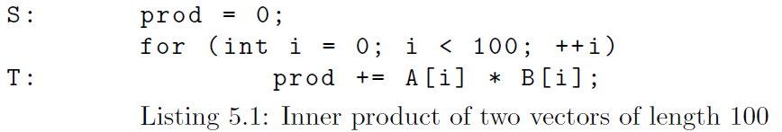

### Example 5.4

代码片段5.2用于计算两个长度为n的A和B的向量的内积。与程序5.1的区别是，5.1部分代码中循环条件的值为100，现在被替换成了一个变量n。因为变量n在程序运行的阶段不会改变，那么该程序段的实例可以通过实例集合表示如下：

$\{S[]; T[i] : 0 \leq i < n\}$

其中n是一个常量符号。

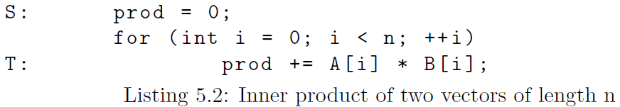

### Alternative 5.5 (Per-Statement Instance Set)

许多方法不是对包含所有多面体语句的所有实例的某一个实例集合进行操作的，而是为每一个多面体语句单独维护一个实例集合。


### Alternative 5.6 (Instance Set Name)

实例集中有很多常用的名称（通常是每个语句），包括迭代域（iteration domain）、索引集（index space）和迭代空间（iteration space）。 这些集合的元素通常称为迭代向量（iteration vectors）。

### Alternative 5.7 (Instance Set Representation)\

许多方法对每个语句的实例集使用更严格的表示。特别是，这些表示不允许出现任何整数除法或者量化（quantifier）。部分的表示不允许任何的析取（disjunctions）（包括对连词的否定）。

在后面登录izi当中，一个语句的实例可以表示成一个多面体模型中的整数点。

---
析取这里应该理解成“或”
这里连词比如and 和 or等等。

### Alternative 5.8 (Ordered Instance Set)

有一些计算方式需要将实例集合中的元素set(s)看成是有序的，比如字典序。对这些元素的顺序进行变换相当于修改实例集合set(s)。

### 5.2.2 Input Requirements and Approximations
为了能够准确的表示程序片段中的动态执行实例，该程序片段需要满足一些特定条件。最重要的是，该程序片段需要有静态控制流。即，控制流的需要在编译期就能判定出来，以及其依赖的常量符号值。这意味着控制流不能依赖任何方式的输入数据，而且编译器能够识别出控制了。简单来说，例如，代码不能包含任何goto语句。静态控制流需要允许编译器在编译期准确的判定哪些动态实例会在运行期运行。为了能够将这些实例编码成Presburger 公式的形式，需要添加一个更加严格的约束条件。通常，所有在代码中的条件变量需要都必须是外层循环迭代和参数的仿射表达式（拟仿射表达式），循环迭代的初始值必须是外循环迭代和参数中的仿射表达式（拟仿射表达式），并且循环的步长必须是一个整数常量。

### Example 5.9
见代码段5.3中的增量计算器的伪代码。因为while-loop没有任何显示（explicit）的循环迭代，因此它不能用来表示两个语句在循环中的实例。此外，使用拟仿射表达式来描述循环迭代（以及语句的实例数量）的次数通常来说不太可能。如果程序能够保证是可以停止的，那么代码仍然可能表示成实例集合如下：

$\{ I[]; E1[]; U[i]: 0 \leq i < N; E2[i]: 0 \leq i < N\}$

其中N为一个常量符号，表示循环迭代的次数未知。然而，这样的编码形式仅可能用于一个最外层的while-loop，因为嵌入在其它循环中while-loop的循环迭代通常依赖它外面一层的魂环迭代，因此不能使用一个单一的常量符号来表示。

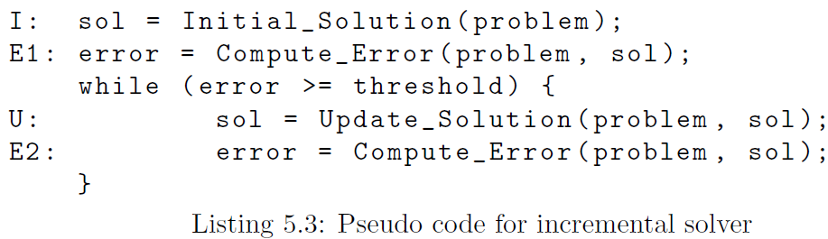

### Exmaple 5.10
考虑代码片段5.4.如果一个变量n是位置的，那么使用循环迭代的值i来表示每个驯化按的实例时，它不可能使用Presburger 公式来描述语句S的实例。（如果变量n的值时已知的，那么可以很简单的使用Presburger 公式来逐个枚举）。在这个例子当中，依旧有可能描述它的实例集合如下：

$\{S[j]: 0 \leq j \leq N \land n \geq 1 \}$
其中N和n是常量符号，且满足$N = \lfloor log_2 n \rfloor \ if \ n \geq 1$。因为n再这个程序段的执行当中不会发生改变，n和N是确定可以作为一个常量符号来使用的。然而，对于一个编译器来讲，去提取这样的一个实例集合是比较困难的。而且，对于n和N的关系无法在实例集合中表达。这意味着在后续的计算当中，编译器会考虑n和N结合的情况，但是在实际中不会发生。最终，i的值在模型的另一部分中需要被$2^j$替换，因为次幂无法在Presburger 公式中产生。

应该注意的是，实例集也可能是在运行时实际执行的实例的过度近似（overapproximation)。大多数分析技术在过度近似方面是安全的，因此如果多面体模型仅用于分析目的，则无需进一步调整。如果多面体模型也用于转换输入程序，则需要采取额外的措施来确保在运行时实际执行的实例集对于输入和输出程序都是相同的。这通常需要保持对多面体语句中额外信息的跟踪。

### 5.2.3 在`pet`中的表示

bla bla

### Example 5.11
bla bla

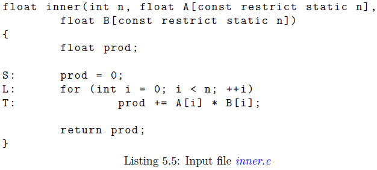


### Example 5.12
bla bla

### Example 5.13
bla bla

### Example 5.14
bla bla

### Example 5.15
bla bla


## 5.3 Access Relations

### 5.3.1 Definition and Representation

访问关系将实例集的元素映射到该语句访问的数据元素。区分读访问和写访问通常很重要。

### Definition 5.16 (Read Access Relation)
读访问关系将每个动态执行实例映射到的要被动态执行实例读取的元素集合。

### Definition 5.17 (Write Access Relation)
写访关系将每个动态执行实例映射到要被动态执行实例写入的元素的集合。

在一些例子当中，精确的判定被访问元素的集合可能是不可能或者不现实的。而且，即使能够准确的判定访问关系，也可能没办法用Presburger 关系来表示。因此访问权限需要时近似的。
在读访问的情况下，过度近似的分析没有问题。但是在写访问分析时，需要多考虑一些。写访问关系的某些用途，例如，用于计算程序片段可能访问的元素的总集合，也允许过度近似。但是有一些写访问是不允许过度近似的，而是需要一个欠近似分析（underapproximation）。这导致有如下三种类型的访问关系。

### Definitino 5.18 (May-Read Access Relation)
一个may-read访问关系是一个二元关系，该二元关系包含读访问关系作为子集。

### Definitino 5.18 (May-Write Access Relation)
一个may-write访问关系是包含写访问关系作为子集的二元关系。

### Definition 5.20 (Must-Write Access Relation)
一个must-write访问关系是二元关系，它是写访问关系的子集。

请注意，这些定义没有指定关系的确切内容，而只是在may-read和may-write关系的情况下它们至少包含一些元素对，或者它们最多包含一些元素对以防万一的must-write关系。这种灵活性在编译时不清楚给定动态执行实例将访问哪些元素或无法准确表示此信息的情况下很有用。在这些信息可用并且可以准确表示的情况下，可以限制/扩展访问关系以准确地包括那些被访问的数据元素。may-write访问关系等于must-write访问关系。 通常，must-write访问关系是may-write访问关系的子关系。

利用以上的三种访问关系不需要精确的事实，因此可以表示成Presburger 关系。二元关系的domain元素是实例集合的元素，因此有相同的表示。range元素，即访问的数据元素，以类似的方式表示。与实例集的元素一样，这些数据元素以组（groups）（通常是数组）的形式出现，每个元素由组（数组）的名称和组唯一的整数序列（数组的索引）标识 元素）。请注意，由于无法索引标量，因此标量的表示仅由名称组成，并且相应的整数序列为空。即，一个标量看成是一个0维度的数组。

### Example 5.21 
考虑代码片段5.5。访问关系如下面的代码所示。记，may-write访问关系等价于must-write访问关系，因为访问的性质完全可以在编译器决定下来，并且可以用Presburger公式描述。即语句T中访问prod会更新prod，因此将其看作是一个同时拥有读和写的访问。

iscc的例子如下：
```python
P := parse_file " demo / inner .c";
print "Must - write :";
print P [1];
print "May - write :";
print P [2];
print "May - read :";
print P [3];
```
输出为：


```python
"Must - write :"
[n] -> { S[] -> prod []; T[i] -> prod [] : 0 <= i < n }
"May - write :"
[n] -> { S[] -> prod []; T[i] -> prod [] : 0 <= i < n }
"May - read :"
[n] -> { T[i] -> B[i] : 0 <= i < n; T[i] -> A[i] : 0 <= i < n; T[i] -> prod [] : 0 <= i < n }
```

请注意，访问关系不必是函数，因为多个元素被多面体语句的同一实例要么直接或间接有效地访问，或者因为不清楚正在访问哪个元素以便可以访问多个元素。 在最坏的情况下，可以访问整个数组，其中数组元素的集合是从数组的声明中派生的。如果此数组是 C 函数的函数参数，那么通过将 static 关键字放在其他虚拟大小表达式旁边来指定数组在外部维度中的大小也很重要。

### Example 5.22
清单 5.11 中分析的程序片段包含两个语句，它们从同一个实例访问同一个数组的多个元素。在语句S中，访问是通过调用 `set_diagonal` 函数间接执行的，而语句T仅包含对同一数组的两次读取访问（一次纯读取，一次更新）。 完整的访问关系显示在下面的脚本中。

```python
P := parse_file "demo/diagonal.c";
print "Must-write:";
print P [1];
print "May-write:";
print P [2];
print "May-read:";
print P [3];
```
输出结果为:
```python
"Must - write :"
[n] -> { T[i, j] -> A[i, j] : 0 <= i < n and j > i and 0 <= j < n; S[] -> A[o0 , o0] : 0 <= o0 < n }
"May - write :"
[n] -> { T[i, j] -> A[i, j] : 0 <= i < n and j > i and 0 <= j < n; S[] -> A[o0 , o0] : 0 <= o0 < n }
"May - read :"
[n] -> { T[i, j] -> A[i, j] : 0 <= i < n and j > i and 0 <= j < n; T[i, j] -> A[i, -1 + j] : 0 <= i < n and j > i and 0 < j < n }
```

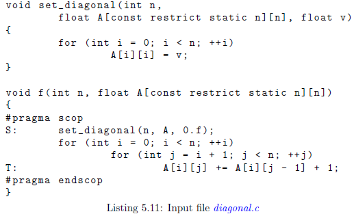


### Example 5.23 

代码清单里面展示一个程序，该程序中的索引表达式不能使用仿射表达式来表示。其中must-write访问关系为空，然而may-write的访问关系定义为访问整个数组，其中约束来自数组大小。访问关系由`pet`推到得到如下结果：

```python
P := parse_file " demo/square.c";
print "Must - write :";
print P [1];
print "May - write :";
print P [2];
print "May - read :";
print P [3];
```

输出为:
```python
"Must - write :"
[n2 , n] -> { }
"May - write :"
[n2 , n] -> { S_0[i] -> A[o0] : 0 <= i < n and 0 <= o0 < n2 }
"May - read :"
[n2 , n] -> { }
```

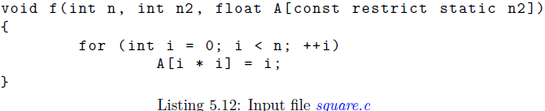

### Alternative 5.24 (Exact Access Relations)
许多方法不考虑单独的may-write和must-write访问关系，而只是考虑write关系这么一种。 然后，这些方法还需要对输入程序可能执行的访问类型施加限制。

### Alternative 5.25 （(Per-Reference Access Relations）
很多方法不考虑描述整个程序片段访问的全局的访问关系，而是对每个在多面体语句中的数组引用维护一个单独的访问关系。

### Alternative 5.25 （Access Functions)
一些方法不允许多面体语句实例内的引用访问多个数据元素并使用函数来表示访问而不是更通用的的关系。这些访问函数太牛然的定义在每个引用，通常也很精确。这样的访问函数与5.8节多面体语句中的索引表达式有一些相似的地方，但是并不完全相同。

### 5.3.2 Aliasing
为了能够正确地构造may-read访问关系和may-write访问关系，编译器需要了解程序中可能发生的任何别名。例如，一个语句写到A，A可能是B的别名，那么may-write访问关系需要包含语句访问B。在最坏的情况下，每个多面体语句实例的写操作都要考虑对所有数组的所有元素执行写操作的可能，这样的情况下u都面体模型就没有什么用处了。因此最好在程序中尽可能的避免使用别名，这也是为什么特别是在多面体编译当中不允许使用任何指针的操作。

有如下三个方法避免使用别名:
- 忽略别名，包括像`pet`这样的一些工具，简单的假设在两个不同的数组当中没有别名。
- 禁止使用别名，这种方法的一种变体是从不允许别名的源语言中提取多面体模型。 但是，在诸如C之类的源语言中，确实需要考虑别名。本地声明的数组不能相互别名，但传递给函数的数组实际上是指向数组开头的指针（至少在 C 中），因此此类数组可以别名。关键字`restrict`可以用在这些指针上表示它们实际上没有别名。如果一个数组是通过函数传参而来的，那么外部外部数组的元素也是指针，并且应该对这些它们进行标识，以标识在数组的某一行之间没有别名。然而，在实际情况下传递的都是多维数组。在多维数组的情况下，一行中的数据连续存储在内存中，因此保证不会有别名产生。
- 运行时别名检查，此方法为了分析和转换代码，会假定数组不使用别名，但是会搜集多组可能会有别名的数组。然后将额外代码插入到转换后的程序当中，以在运行时检查这些组（group）中是否有别名产生。如果没有别名，原始的代码会被执行，否则要将代码进行变换后再执行。


### 5.3.3 structures
访问一个plain的结构体，例如，结构体当中不包含任何指针，从原理上不需要任何特殊的对待。对于这样的访问，只要注意找到一个正确的表达方式。指针可以允许，但是为了避免产生引用，必须像函数参数或者嵌套数组的元素一样使用`restrict`关键字来进行修饰。递归数据结构更有挑战性，目前再多面体框架中如何表示它们还是不清楚。
在`pet`中访问一个结构体的fileds使用wrapped关系进行编码。特别的，访问关系中的range是一个标识了结构体wrapped 关系，这个range关系的domain标识了结构体，range关系的range标识了结构体中的filed。这个wrapped 关系的标识符由外层的数组或者标量名称和字段的名称组成。

### Example 5.27
考虑代码清单5.13中的程序。它包含一个对c数组元素的b字段的写访问，结构体类型是`struct s`。对应的访问关系如下。

输入为:
```python
P := parse_file " demo/struct.c";
print P [1];
```

输出为:

```python
{ S[i] -> c_b[c[i, i] -> b[9 - i]] : 0 <= i <= 9 }
```
---
结构体嵌套是使用wrapped的形式进行编码;从里往外读，`c[i, i] -> b[9 -i]`表示`c[i, i]`访问`b[9 - i]`；语句S访问标识的访问关系要用wrapped的形式包装


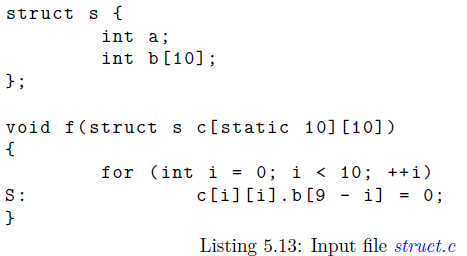

### Example 5.28
考虑代码清单5.14。其包含一个写访问，写到一个结构体`f`数组的`a`的字段当中，结构体数组`f`是结构体`S`的字段。
下面的代码输出了访问关系。

```python
{ S_2[i, j] -> s_f_a[s_f[s[] -> f[i]] -> a[j]] : 0 <= i <= 9 and 0 <= j <= 9 }
```
注意，访问整个结构体意味着访问该结构体的所有字段。这也说明了它再`pet`中如何表示。当结构体传递到一个函数当中时，这样的对结构体的访问操作与如何访问整个数组或者数组的某一行的访问是相似的。
---
这里语句S_2对应到两层循环中的计算操作（图里面没有标识出来）;
`s[]`访问`f[i]`标识为`s[] -> f[i]`;将该访问关系用`s_f`包装后再用`->`标识访问其中字段`a[j]`，再用`s_f_a`包装，表示语句`S_2[i, j]`访问`s_f_a`。


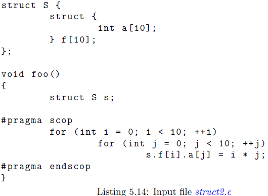
### Example 5.29
bla bla


### 5.3.4 Tagged Access Relations

标准访问关系将语句实例映射到该语句实例访问的数据元素。 但是，给定的语句可能会多次引用相同的数据结构，在某些情况下，区分各个引用很重要。 例如，当`PPCG`确定将哪些数据复制到设备/从设备复制时，它会检查哪些写引用产生的数据仅在给定内核中使用。 这要求引用可以从依赖关系中识别出来，这反过来又要求它们被编码在访问关系中。

在`pet`当中，对于程序中的每个引用都会生成一个独立的标识符。这些标识符后续会用来 **标记（tag)**那些执行访问的语句实例，因此称之为标记访问关系。尤其是，这样的标记访问关系的domain是一个wrapped 关系，domain是语句实例，range是引用标识符。通过计算domain产生的domain 因子可以可以用来去除标记访问关系的标记。标记访问关系可以从`pet_scop`中使用如下的函数抽取。

- pet_scop_get_tagged_may_reads
- pet_scop_get_tagged_may_writes
- pet_scop_get_tagged_must_writes

### Example 5.30
程序清单5.11中的代码作为输入

```python
import isl
import pet

scop = pet.scop.extract_from_C_source(" demo/diagonal.c","f");
may_read = scop.get_may_reads()
tagged_may_read = scop.get_tagged_may_reads()
print may_read
print tagged_may_read
factor = tagged_may_read.domain_factor_domain()
print may_read.is_equal( factor )
```

输出为

```python
[n] -> { T[i, j] -> A[i, j] : 0 <= i < n and j > i and 0 <= j < n; T[i, j] -> A[i, -1 + j] : 0 <= i < n and j > i and 0 < j < n }
[n] -> { [T[i, j] -> __pet_ref_2 []] -> A[i, j] : 0 <= i < n and j > i and 0 <= j < n; [T[i, j] -> __pet_ref_3 []] -> A[i, -1 + j] : 0 <= i < n and j > i and 0 < j < n }
True
```

## 5.4 Dependence Relations
本节仅描述依赖关系的一般概念。 依赖关系的计算在第 6 章依赖分析中描述。
通常依赖是一堆语句实例，表示第二个应该在第一个实例执行后再取执行。一个依赖关系是一组依赖的集合。依赖的产生通常是两个语句实例要访问相同的内存元素。根据所涉及的两种访问的类型，可以区分不同类型的依赖关系。

### Definition 5.31 (Read-after-Write Dependence Relation)
写后读的依赖关系，如果语句实例j在语句实例i之后执行，并且j要读取被i写入后的元素，那么将语句实例i映射到语句实例j。

### Definition 5.32 (Write-after-Read Dependence Relation)
读后写依赖关系，如果语句实例j在i之后执行，并且j要写入被i读取之后的元素，那么将语句实例i映射到语句实例j。

### Definition 5.33 (Write-after-Write Dependence Relation)
写后写依赖关系，如果语句实例j在i之后执行，并且j要写入被i写入之后的元素，那么将语句实例i映射到语句实例j。

作为访问关系的例子，想要准确的计算出访问关系或者使用Presburger关系进行准确表达是不太可能的。然而，因为访问关系仅表示第二个语句实例应该在第一个语句实例之后执行，因此可以看作过度近似是安全的。本手册其余部分提到的任何写后读的依赖关系实际上都是may写后读依赖，对于任何读后写依赖关系或者写后写依赖关系也是类似的。

写后读依赖关系的元素称作写后读依赖。因为读访问可能会读取一个已经被一个写访问写过的值。

读后写元素依赖关系也成为反依赖。即一个写访问关系可能会写入一个已经被读过的值。

写后写元素依赖关系也称为输出依赖。即第二个写访问可能会写入一个已经被第一个元素写过的值。强制在第二次写操作之前执行第一个写操作，对于确保原始程序中的元素的最终只不会被之前的程序所覆盖，这点很重要。

读访问之间的关系没有给出，因为只读的访问关系不重要，也不会互相产生影响。但是从优化上来看，两个语句实力读取相同的内存元素还是值得考虑的。与实际的依赖关系类似，这样的语句实例有时被称之为读后读依赖关系，或者输入依赖。不过注意，与实际的依赖性质不同，输入依赖的顺序对语句实例没有影响。

### Example 5.34

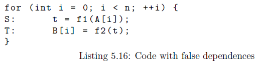

考虑代码清单中5.16的代码。两个语句都访问标量t，其中S写入标量，并且T读取标量。依赖关系如下所示。

写后读依赖关系为：

$\{S[i]->T[i'] : i' \geq i \}$

---
后面的谓词逻辑要求$i' \geq i$ ，即要满足T访问的元素一定是S已经访问过的。


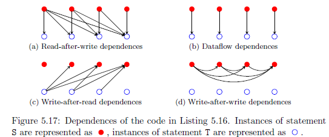

写后读如图5.17a所示。

读后写的依赖关系为：$\{T[i]->S[i']: i' > i\}$如图5.17c所示。

写后写的依赖关系为：$\{S[i]->T[i']: i' > i\}$如图5.17d所示。

这些关系的计算在Exmaple 6.1中展示

---
从图中可以看到红圈表示语句实例S，蓝色空圈表示语句实例T。

顺序从左向右看，箭头指向就是二元关系里面的指向方式。

目前所描述的依赖关系主要目的是确保在读取值之前将值写入到内存，并保证它们之间不会被覆盖。在一些例子当中，可能会有很多这样的依赖关系，这些语句实例的执行顺序可能很难被改变。例如，一个临时的标量变量用来存储不同的数据，那么上边的依赖关系将序列化方位该标量的语句实例。通过在内存中不同的位置存储不同的数据，那么有一些依赖关系就不再需要，并且可以有更自由的的方式来创建改变这些语句实例执行的顺序。特别是，反依赖和输出依赖可以被去掉，因此它们也被称之为假依赖。为了能够将不同的数据映射到不同的内存位置，确定新值的写入位置以及需要存储多久非常重要，该信息由数据流依赖项获取。特别是，对内存位置的任何写入与从同一内存位置读取的任何后续读取之间都存在数据流依赖性，后者仍会找到由写入访问写入的值。 也就是说，内存位置在两者之间没有被覆盖。

### Definition 5.35 (Data-flow Dependence Relation)
数据流依赖关系是（确切的）写后读依赖关系的子集，并且包含那些语句实例对中，没有对两个语句实例访问的相同数据元素的中间写入。数据流依赖也成为值依赖（value-based）,因为值依据依赖关系保留的。相反，之前描述的依赖被称为内存依赖（memory-based）,因为它们仅访问相同的内存位置。

通常，准确的表示或者判定数据流依赖关系是不可能的，在写访问的情况中，区分潜在的数据量和确定的数据流是很重要的。这导致了如下的两种数据流依赖关系。

### Definition 5.36 (May-Data-flow Dependence Relation)
一个may-dataflow 依赖关系是一个二元关系，包含数据流依赖关系作为子集。

### Definition 5.37 (Must-Dataflow Dependence Relation)
一个must-dataflow的依赖关系是一个二元关系，该二元关系是数据流依赖关系的一个子集。

两个依赖关系都是以标记（tagged）的形式出现，其中每个语句实例都有一个引用标识符，比如5.3.4节的标记访问关系。这些被称为tagged may-dataflow依赖关系和tagged must-dataflow依赖关系。must-dataflow依赖关系是may-dataflow依赖关系的子集。如果数据依赖可以执行的精确，那么两种依赖是互相等价的。may-dataflow依赖关系本身是（may-)read-after-write依赖关系的子关系。untagged must-data数据流依赖关系仅在每个语句最多包含一个写访问才有用。

### Example 5.38
再看代码清单5.16。每个被语句实例S写入的到标量t的值都被下一次循环迭代的语句S写入覆盖。这表示该值仅会被其中的语句实例T读取。那么数据流依赖关系为:

$\{S[i] -> T[i]\}$

注意这个关系是一个写后读依赖的严格子关系（strict subrelation）。如图5.17b所示。

### Alternative 5.39 (Per-Statement-Pair Dependence Relation)
很多方法不会包含不同多面体语句实例的单个依赖关系进行操作，而是跟踪每对语句单独的依赖关系。再一些例子当中依赖关系被进一步分解，可能会沿着析取（disjuncts）范式表示的析取。

### Alternative 5.40 (Dependence Polyhedron)
一些方法将依赖关系表示为多面体形式，输出与输出的元组是简单的连接关系。这种表示叫做依赖多面体模型。因为一个单独的多面体不能表示析取范式的形式。此外，普通多面体也不支持存在量化变量（existentially quantied），这意味着通常无法准确的表示数据流依赖关系。 

### Alternative 5.41 (Depends-on Relation)
一些作者喜欢考虑从语句实例到该语句实例所以来的语句实例的依赖关系。即，与上面定义的依赖关系相比，两个语句实例的位置是相反的。在提取数据流依赖的例子中，这以为这依赖关系可以表示成一个函数，对于每个读操作最多存在一个写操操作，这个写操作会写入一个要被读取的值。


## 5.5 Data-Layout Transformation

数据布局变换改变数据在内存中的存储方式。可能是仅改变了数据的元素的顺序，但是也可能将一些在原始程序中的一些数据元素映射到一个单独的数据元素，或者反过来，将原始程序中的单个数据元素映射到多个。数据布局变换中将多个数据映射到一个单独的数据元素的行为叫做收缩（contraction）。将单独的数据元素映射到多个元素叫做扩张（expansions）。注意，数据布局变换通常还需要修改变量的声明。在`isl`当中，数据布局变换可以表示成一个你仿射表达式的多空间分段元组。该函数的范围（range)对应到新的数据元素。在一个简单的情况下，数据被统一重新排序，函数的域（domain）直接对应于原始数据。如果变换依赖于语句实例，那么域（domain)应该是一个可以访问的关系（wrapped）。尤其是，扩张操作依赖语句实例。变换也可以参考特定的情况，在这种个情况下，域应该是一个tagged的访问关系（wrapped）。

### Example 5.42
见代码列表5.16中的程序。在Example 5.34中的解释，代码展示了一个错误的依赖。可以通过将标量`t`使用一个扩张操作变成一个大小等于循环中的迭代次数的数组元素来删除依赖关系。比如下面:

$\{[S[i] -> t[]]->t[i]; [T[i]->t[]]->t[i]\}$

代码5.18为扩张后的结果。相反，收缩的形式为
$\{[S[i] -> t[i]]->t[]; [T[i]->t[i]]->t[]\}$ 或者简称为 $\{t[i] -> t[]\}$ 应用于代码清单5.18中的部分，以获得代码5.16中的代码。

---
5.16中的代码执行扩张操作得到5.18，5.18中的代码执行收缩操作得到的5.16。

## 5.6 Schedule

### 5.6.1 Schedule Deifinition and Representation

### Definition 5.43 (Instance Set)
调度S定义了一个在实例集合元素上的严格的偏序关系 $<_{S}$。


尤其是，一个调度的描述或者规定了元素实例集合的执行顺序。注意一些方法不会追踪一个单独的调度，而是像Alternative 5.8的实例集合顺序描述的，将执行顺序编码到实例集合当中。其它的方法中，至少包括那些执行程序转换的方法，通常会跟踪两个调度，一个表示原始程序的执行顺序，被称为输入调度，另一个表示最终希望得到的执行顺序。后者可以从输入的调度通过推导（incrementally）的方式构建，或者也可以通过5.9 Operation中解释的部分使用依赖关系计算出来。

一个表示调度S的朴素办法是直接使用Presburger关系来编码严格的偏序关系$<_{S}$。然而，这样的关系将包含几乎所有语句实例对的一半，因此它的表示在语句数量上至少是一个二次方的倍数。
这种顺序总是通过某种形式的调度间接表示的。
表示一个调度的一种办法是使用一个接近命令时程序形式的调度树。命令式程序表示执行顺序的两个主要方法分别是复合语句，表示组成语句按照给定的执行顺序执行；以及循环，表示执行相同语句的不同实例的顺序。在调度树中节点的主要类型与这两个机制相关。尤其是，调度树中的序列节点（sequence node）表示了它的儿子会以给定的顺序执行，另外一个带节点（bank node）表示执行不同的语句实的顺序。序列节点的每个子节点都使用 Presburger 集进行注释，描述该子节点表示的语句实例。该集合叫做子节点的过滤（filter)。带节点表示的顺序由一个多空间分段拟仿射表达式元组表示，称为带的部分调度（partial schedule of the bank）。如果带节点的部分调度为其分配了按字典顺序较小的值，则该语句实例由带节点排序在另一个语句实例之前。为了完备表示，还引入了一个叶子节点，用来表示调度树的叶子。通过引入这样的叶子节点，所有的带节点都只有一个孩子，所有的叶子都没有孩子。叶子节点使用$\bot$符号表示，通常情况下省略。

---
介绍了序列节点，带节点、叶子节点、节点过滤以及部分调度（仅在bank node当中）。

序列节点表示孩子节点会以给定顺序执行；带节点表示执行不同语句实例的顺序。


### Example 5.44
再次看代码列表5.2中的代码片段。一个在图5.19中展示了代码片段中表示输入调度的的调度树。根节点是一个与5.2代码列表中顶层（top-level）语句序列逐一对应的序列，语句S和for循环。序列节点表示了S语句作为一个单独的语句实例会在所有的T语句的实例之前执行。在这个图中，两个Presburger 集合描述了语句实例的属于两个子节点，并且写入到顺序节点当中，并用逗号分隔。第一个孩子节点仅一个语句实例，因此不需要多余的表达指令，仅作为一个简单的叶子节点出现。第二个孩子是一个带节点，对应于代码列表5.2中的for循环。它表达了实例$T[i]$会根据增长变量$i$来进行执行。在Example 5.4中给出了这段代码的的表达式形式，其中i表示循环迭代的值，这表示在实例在for循环中的执行顺序。一个单独的带节点的孩子同样是一个叶子节点。


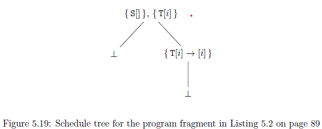

算法5.1展示了如何通过从上到下遍历调度树来判断两个语句的执行顺序。如果遍历到一个叶子节点，那么调度树不指定两个实例的顺序。如果两个实例属于同一个序列节点的孩子，那么该算法会向下遍历到孩子节点。如果两个实例属于序列节点的不同孩子，那么孩子节点的顺序决定了语句实例的顺序。如果遍历到一个带节点，那么要在两个实例处评估部分调度的值来确定它们的顺序。如果两个实例评估的值相同，那么算法会向下移动至带节点一个单独的子节点。注意执行顺序可能不一定是全部的顺序，$i<_{S}j$以及$j<_{S}i$ 可能为假。通过判断任意两个语句的执行顺序，可以构造完整的顺序关系。

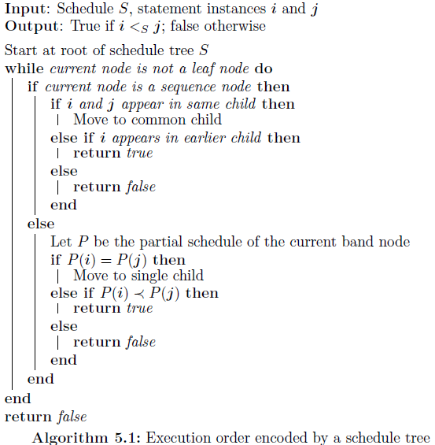

### Example 5.45
图5.19中，由调度树定义的顺序关系如下:

$\{ S[] -> T[i]: 0 \leq i < n; T[i] -> T[i'] : 0 \leq i < i' < n\}$

---
上面的表达式表示了执行顺序先执行$S[]$再执行$T[i]$，然后再执行$T[i']$

调度可以被编码成一个Presburger关系，本质上是将调度树扁平化（flattening）成一个单独的带节点，并将多空间分段拟仿射表达式元组形式转换为Presburger 关系。特别的，这意味着关系的范围（range）存在于一个单个的空间（space）当中，执行顺序由该空间中的字典序决定。扁平化的过程由Algorithm 5.2所示。该过程要么返回一个叶子节点（如果输入仅由一个叶子节点组成）或者返回一个带节点。

如果输入的根节点是一个带节点，那么结果是该节点与其扁平化的单个子节点的连接（concatenation）。这里连接的含义是在计算的部分调度上的范围乘积。（range product）

如果输入的根节点是一个序列节点，那么其子节点会被分配一个序列值，该序列值与参与的子节点的部分调度相结合。

如果扁平化的子节点是一个叶子节点，那么将其看作成一个0维度的带节点。如果扁平化的孩子节点不是全都有相同数量的成员，那么成员较少的孩子会被填充任意值，比如0。所有这些组合的并集形成带节点的部分调度。

---
这里的维度应该是指有几个子节点

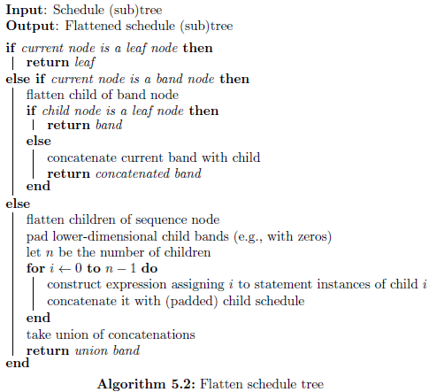

### Example 5.46
考虑图5.19中的调度树。根节点的第一个节点是一个叶子节点，即不需要任何处理。从根节点的视角来看，可以把它看成是一个0维度的带节点，其部分调度的为$\{S[]->[]\}$。根节点的第二个孩子节点是一个带节点，其只有一个叶子节点作为孩子。因此这个节点也不需要多余的处理。因为带节点的第一个节点是0维度，而第二个孩子节点是1维度，那么第一个节点要补0为$\{s[] ->[0]\}$。两个带节点的调度会被添加一个前缀，该前缀反应了它们在序列中的位置，从而产生$\{S[] ->[0, 0]\}$以及$\{T[i] -> [1, i]\}$。最后扁平化的序列节点会由如下两个部分的调度。

$\{S[] -> [0, 0]; T[i] -> [1, i] \}$


### Alternative 5.47 (Per-Statement Schedules)
一些作者使用逐语句的调度而不是描述所有语句实例的相对顺序的单个调度。然而，这仅反应了调度如何表示的一个细节。即使不同的调度跨越了多个语句进行存储，也不能互相独立的解释。比较有名的表示是Kelly抽象和2d+1调度。

虽然在Presburger关系中，对一个调度树进行扁平化，与整个调度表示相同的顺序。有时候知道调度树中给定节点的语句实例的顺序就足够了。在本例子中，由序列节点得到的顺序是无关的，因为到达给定节点的所有语句实例都在每个外部序列节点的同一个子节点中。由所有外部带节点的部分调度的连接给出的顺序。 这种连接称为给定节点的前缀调度（prefix schedule）。

### Example 5.48

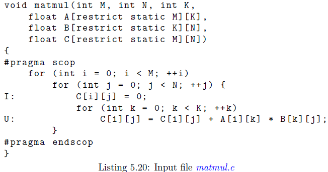

考虑代码列表5.20中的程序。

在带节点中对应于最外层for循环的前缀调度(prefix schedule)为:

$\{I[i, j] -> []; U[i, j, k] ->[]\}$

对应于第二个循环的节点为:

$\{I[i, j] -> [i]; U[i, j, k] -> [i]\}$

对应于第三个循环的节点为:

$\{U[i, j, k] -> [i, j]\}$

最后，对应于U语句的叶子节点为:

$\{U[i, j, k] -> [i, j, k]\}$


---
没有太明白上面的含义

对应于循环的节点是指循环的第几层？


### 5.6.2 Representation in isl
在isl中，调度树使用`isl_schedule`类型表示。在调度树中的节点可能在不同的类型和编码上与前面几个章节的描述有所不同。尤其是，带节点直接出现在编码当中。然而，序列节点表示为一个纯序列节点（pure sequence node），即仅表示其子节点按照顺序执行，过滤节点（filter node）描述由任何特定子节点执行的语句实例。

而且，在`isl_schedule`中，调度树的根节点是一个域节点（domain node在下面有定义），包含了整个实例集合。由`pet`抽取出来的调度中，带节点的部分调度的元组标识符由其对应的for语句标签推导而来（如果有标签）。

`isl_schedule`的文本表示是一个`YAML`文档。一个节点在`YAML`文档中要么是一个标量，要么是一个序列，要么是一个映射（关联的数组），其中在序列中的元素，在映射中的keys和values本身都是`YAML`节点。这个文档可以分块（block）的形式或者流形式（flow）打印出来。在一个调度树中的每个节点都被编码为如下的`YAML`文档当中的节点信息。

**domain node**

一个YAML，将`domain`和`child`作为键值，对应的value是实例集合与域节点（domain node)的单个子节点。

**band node**

一个YAML，将`schedule`和`child`作为键值，对应的value是带节点的部分调度与带节点的单个子节点。重合键（coincident key）将在5.6.3中的编码并行中解释。

**sequence node**

一个YAML，将`sequence`作为键值，对应的value是一串YAML序列作为序列节点的子节点。

**filter node**

一个YAML，将`filter`和`child`作为键值，对应的value是filter和域节点的单个子节点保存的实例集合的子集。

如果一个节点有一个单独的子节点，并且如果这个子节点是一个叶子节点，那么这个子节点可能文本表示中被省略掉。集合节点和它们的表示会在5.6.3的并行编码中介绍。

### Example 5.49
考虑下面的调度，用`isl`表示的图5.19中的调度信息。调度信息打印了两次，一次是以块的格式打印（block），一次是以流的格式打印（flow）。为了强制打印的流格式，第二个实例以一个部分列表的形式打印出来。`isl`表示出来的结构与图5.19中的调度树相同。主要的区别在于根节点中额外域节点以及叶子节点的省略。

输入的源文件是代码列表5.5中的内容

```python
P := parse_file " demo/inner.c";
print P[4];
print (P[4] ,0);
```

输出为:

```python
# 第一次，块格式打印
domain : "[n] -> { T[i] : 0 <= i < n; S[] }" # domain node， key是domain这个标签, value是->后面的部分?
child :
sequence : # sequence node，key值就是sequnece这个标签，value是后面的一串子节点?
    filter : "[n] -> { S[] }" # filter node
    filter : "[n] -> { T[i] }"
        child :
            schedule : "[n] -> L[{ T[i] -> [(i)] }]" # 这个就是band node呗?

# 第二次，流格式打印
({  domain : "[n] -> { T[i] : 0 <= i < n; S[] }", 
    child : {
        sequence : [
             { filter : "[n] -> { S[] }" }, 
             { filter : "[n] -> { T[i] }", 
                child : { 
                    schedule : "[n] -> L[{ T[i] -> [(i)] }]" 
                } 
            } 
        ] 
    } 
}, 0)
```

通过在`isl`表示的调度树的指示，调度信息表示成了一个`isl_schedule_node`类型，该对象指向树中的特定节点。通过使用`isl_schedule_get_root`可以获取到调度树根节点的指针，使用`isl_schedule_node_parent`和`isl_schedule_node_child`可以用来在树中获取父节点以及子节点信息。通过使用`isl_schedule_node_get_schedule`可以检索调度树中节点的详细信息。该功能在用于修改调度树中是非常有用的。文本表示下的一个`isl_schedule_node`与树中的表示相同，除了在以块形式表示的节点中标注的那句“YOU ARE HERE”以外。python接口打印出的块形式的调度树如下。