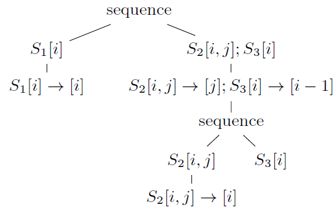

目标：
1. Schedule Trees论文的翻译并理解
2. 给出基于`isl`的例子，并理解其API的功能

这是一篇混合了综述的文章，前面3章节都是在将之前的人做了哪些工作，还给出了比对。要了解调度树重点看第四部分。

# ASBTRACT

在多面体模型中，原始的执行顺序以及由调度算法产生的调度都是可以自然的表示成一个树的形式。文献当中提到的通用调度表示该树结构进行编码，使其仅能够隐式调用（implicitly available）。遵循`isl`的内部表示，我们建议将调度树表示为显示的树结构，并且通过引入不同的节点类型来扩展该概念。我们将我们的调度树与其它表示进行详细比较，并说明它们如何成功的一个非平凡的（non-trival）多面体编译器的实现。

# INTRODUCTION

多面体模型是一个用于程序分析以及程序部分变换（transforming）的高效抽象，该抽象具有足够的规则性。（sufficiently regular）多面体模型的主要特点就是它是基于实例的（instance）。即，每个语句实例（例如每个在循环当中的动态执行的语句）以及每个数组元素都被视为独立的，并同多面体以及Presburger关系实现一个紧凑的表示。一个程序通常表示为包含语句实例的迭代域（iteration domains）；将语句实例映射到数组元素的访问关系（access relations）；相互关联依赖的依赖关系（dependences）；对语句实例添加执行顺序的调度（schedule）。

调度的形状表示方式随着调度的计算方式变化而变化。然而，多数调度算法都会递归的分解依赖图，在每个级别上将图分解成强连通分量（strongly connected components），并分别计算每个分量的部分调度（partial schedule）。部分调度通常是一个仿射函数（有可能是一个拟仿射或者是一个分段仿射函数）。完整的调度后续会通过将部分调度以某种“连接”的方式获得，并将语句实例映射到调度空间（schedule space）当中。
在完整的调度当中，两个语句实例的顺序由两种以下情况决定，一个是外部部分调度（the outer partial schedule）对两个实例产生的不同的值，另外一个是分隔开两个实例的外部分量对（outer pair of components），即以出现在最外层为准（outermost）。

---
上面一段中，最后一句话没太看明白，部分调度的outer是指什么？ 更深层次的理解，部分调度是指什么？

---

由Darte等人提出了一些关于这些算法的综述。当计算一个tilable bands（这个是Pluto算法中提出的概念）时，部分调度时一个多维仿射函数，并且由部分调度决定的顺序是通过字函数值上的字典序决定的。

以上的描述提示了一个以树的形式表达的调度形式，每个节点表示一个部分调度，并且分量的顺序是由孩子节点的顺序决定的。当我们从抽象语法树中提取这样的表示时，看起来似乎是一个很自然的方法用来表示原始程序的顺序。然而，我们不知道由任何的先前工作明确的在这样的调度树操作（除了在`isl`的bank forests）。此外，调度树可以以另外一种方式编码，并且所有的操作都在调度树的编码上执行。根据选择的编码方式，这些操作很快就会变得繁琐和难以理解。

在本论文中，我们提出了一个显示表示一个调度树的方法，并且会直接在树上表示所有操作。我们认为这样的表示方法更自然，更有效而且易于理解。图一表示了一个Kelly抽象或者Girbal表示的调度的调度树。


我们首先一个调度树的一般概念，并且展示之前提出的调度树是如何生成不同调度表示的。我们随后提出了一个要在`isl`将来的版本中使用的专用的调度树概念的实例。这个表示比之前的早期想法更加的一般化，允许显示表示可以并行执行的子树，并在子树中引入额外的符号常量（symbolic constant）。最后我们显示如何使用新的表示方法来简化`PPCG`的实现，并有效的提升了工具的可维护性以及将来的可扩展能力。

# SCHEDULE USES

依赖于所使用的框架当中，可能有一个单独的迭代域包含了所有的语句实例，或者可能是每个语句有一个迭代域。不变的是，一个迭代域中的元素（有可能是被标记的（named））是整数向量，叫做迭代向量。在一些方法当中，这些元素决定了一个隐式的执行顺序，但是意味着每当使用了一次变换（transformation）时，执行顺序就会改变，迭代域本身以及所有依赖迭代域（比如访问关系和依赖关系）需要更新。在本论文中，我们将会按照惯例假设执行顺序是由显示调度确定的，该调度将迭代域中的元素映射到一些其它的目标当中，并带上一个隐式的执行顺序。注意，调度只能规定相关的执行顺序，因此通常有无限多种方法来表示相同的执行顺序，而与所选的调度表示没有关系。在本届，我们泛泛的描述了调度的一些使用，我们将会在section 3比较这些不同的调度表示。

## 2.1 Original Execution Order
虽然有很多工作致力于自动调度技术，即直接从依赖图中构造一个调度，从原始执行顺序开始交互式执行多面体变换的能力对于教学或者手动探索很有用。一些数据流分析的实现（比如isl）也同样从多面体表示当中引入一些调度形式（即使使用类似于lazy array的数据流分析或者数组区域分析的技术，在从AST中提取出多面体表示之前或者期间执行数据流分析可能更可取）。我们的调度因此需要能够表示原始的执行顺序。

当从命令式程序中提取多面体模型时，我们主要需要处理执行顺序、符合语句以及循环这三个结构。为了能够有效的对语句组成进行加墨，调度器需要能表达序列，比如一个语句实例的集合应该在另外一个语句实例的集合后执行。为了能有效的对一个循环建模，调度器需要能够表达由一个在迭代向量上的仿射函数所定义的顺序。在最简单的例子当中，迭代向量由封闭循环的迭代指组成。在这个例子中，仿射函数只是将迭代向量投影到需要建模的循环的迭代器上。通常，一个迭代向量可以是唯一标识语句实例的任何一个整数的序列，并且可能需要更复杂的函数来表达循环的效果。

## 2.2 Transformations

一个多面体标识可以通过构建一个新的调度来执行变换，或者通过修改一些之前已经获得的调度来进行变换。其余的调度可能是一个用于标识原始执行顺序或者是一个早期变换的结果。

### 2.2.1 Schedule Construction

一个自动调度算法的例子，我们概述一个“Pluto 算法”的。该算法输入一个依赖图并递归的构造调度带节点（schedule bands）。依赖图表示的是语句实例依赖其它语句实例，并因此需要产生执行的先后顺序。依赖图的节点由语句组成，图的边是依赖关系。

在每一层递归中，算法先检查依赖图中的分量（弱连通）。这些分量不以任何方式依赖彼此依赖，并因此可以被独立的调度。在每个分量当中，算法寻找强连通分量并把它们标记到拓扑序里面（这一步可选）。对每个（组）强连通分量，算法构造一个以为仿射函数序列（sequcen）或者带（band），这些函数中的每一个都独立于同一个带（bank）中的其它函数所遵循的依赖关系，（ps:同一个band中的仿射函数互相独立），这些函数线性独立（linearly independent）于相同外部带节点（outer banks）中的每个函数，因此优化了一些可优化标准。在带节点构造完成后，依赖图被更新为仅包含语句实例对之间的依赖关系，这些语句实例被当前带节点映射到相同的函数值，并且重复该过程。

因此构造调度器（概念上）是一个树形结构，该树形结的组成包括：构递归的以任意顺序执行语句实例的集合，需要按照指定执行顺序的语句实例的序列以及多费仿射函数。

### 2.2.2 Schedule Modification

给出一个调度（要么是关于原始执行顺序的的调度，要么是从依赖图中构造的），我们可能想要对其应用一系列转换。为了与语句实例（在迭代域中）和它们的执行顺序（由调度定义）之间的明确分离保持一致，这些转换需要表示为调度本身的转换。

我要使用的变换包括仿射变换（通常是统一的），语句顺序、融合、分布式（distribution）、索引集合分离（index set splitting）、剥离（strip-mining）、分块（tiling）。多数这些变换不需要集合、序列和多维仿射函数之外的构造。唯一例外的是strip-mining和tiling，这两个变换需要使用整数除法或者取模运算，因此需要（隐式或者显示的）使用拟仿射表达式。注意我们仅需要考虑非参数形式的strip-mining和tiling。

---

index set splitting 技术（https://webdocs.cs.ualberta.ca/~amaral/papers/BartonCC05.pdf）

即将包含多个条件语句的循环拆分成多个控制了不太复杂的循环结构，比如下面这个例子：

原始程序为:
```
for (i = 0; i < 100; i++) {
    if (i < m) {
        a[i] = a[i] * 2;
    } else {
        a[i] = a[i] * 5;
    }
    b[i] = a[i] * a[i];
}
```
变换后为:
```
for (i = 0; i < m; i++) {
    a[i] = a[i] * 2;
    b[i] = a[i] * a[i];
}

for (i = m; i < 100; i++) {
    a[i] = a[i] * 5;
    b[i] = a[i] * a[i];
}
```


这里strip-mining也叫做loop sectioning，是一种循环变换的技术，可以在SIMD指令集中应用，用于提高访存性能。方法是将大循环分隔成更小的段或条（segments or strips）。通常该方法可以提高cache命中率，并且由于是按照SIMD指令执行，可以减少循环迭代次数。下面有个例子:

原始程序为:
```
i = 1
do while (i<=n)
    a(i) = b(i) + c(i) ! Original loop code
    i = i + 1
end do
```
经过向量化后（向量化需要两个步骤，strip-mine和sclar clean-up）
```
!The vectorizer generates the following two loops
i = 1
do while (i < (n - mod(n,4)))
    ! Vector strip-mined loop.
    a(i:i+3) = b(i:i+3) + c(i:i+3)
    i = i + 4
end do
do while (i <= n)
    a(i) = b(i) + c(i)     !Scalar clean-up loop
    i = i + 1
end do
```

可见strip-mine，就是把一个循环访问的数组展开成可以一次用一个SIMD或者某个向量长度的访问大小的方式。

---


## 2.3 AST Generation

抽象语法树的生成以迭代域和一个调度作为输入，并产生的一个抽象语法树，该抽象语法树用以调度器中给定的顺序遍历迭代域中的每一个元素。该操作也称为多面体扫描（polyhedral scnning）或者代码生成（code gen）。AST 生成对调度表示的约束与其说是调度应该能够表达什么，不如说是可以生成AST的构造类型。很明显，对一组语句实例的集合生成抽象语法树。很明显，为一组语句实例集合生成生成抽象语法树或者为这样的组的序列（sequence）生成抽象语法树是很平常的。分段拟仿射表达式函数可以通过标准的抽象语法树生成器来处理。

迭代域和调度器可能需要引入符号常量（理解成参数），如果迭代域对于符号常量的某些值不为空，那么生成的抽象语法树可能会显示的包含对于符号常量的条件判断。多数抽象语法树生成器允许用户通过提供给抽象语法树生成器关于常量符号的约束来避免生成这样的条件。这条附加信息称为上下文，通常单独传递给抽象语法树的生成器。抽象语法树生成器需要的最后一条信息是一系列选项用来控制抽象语法树的生成方法。

# 3 SCHEDULE REORESENTATION

在不同的上下文中，很多不同的调度表示。有些提出的调度表示仅是为了一个给定的算法用于输入或者输出，因此并不是适合通用调度表示。其它的一些，比如Kelly抽象，"2d+1调度"以及"union map"，已经明确的设计用来作为通用表示。在本节，我们比较了这些表示。

## 3.1 Properties

我们比较调度表示的如下方面。

**分散性(scatterness)**

虽然一些表示包含了单独的调度对象，在其它的表示当中，调度信息分散在不同的目标当中，通常每个语句都有一个对象。

**复合性（compositionality)**

复合性通常被解释为意味着相同的调度表示可以用作调度器转换的输入和输出。在一些例子当中，调度转换本身在使用到调度器之前先被组合。

**部分调度(partial schedules)**

一些调度表示有很强的约束性，并且仅允许有限的预定义集合，以及隐式的部分调度。其它表示允许仿射，拟仿射或者甚至是分段拟仿射部分调度。回忆一下拟仿射调度是需要表示strip-mining或者是tiling的情况。一些表示还将部分调度限制为一个单独的维度。

**序列（sequence）**

很多调度表示不支持显示的表示序列。而是在序列中的每一组语句实例被赋值为一个不同的递增整数。这些递增整数可能会被分配（部分的）为常规的部分调度，或者通过专用的机制指定，通常只允许语句的所有实例使用单个常量。也就是说，这些机制通常不允许将给定的语句实例集合拆分成多个部分。

**集合（collection）**

极少有调度表示能够表示语句实例组可以相对于其它语句实力组以任意的顺序执行。而是，此类集合通常以序列相同的方式编码，设置成一个固定的组的执行顺序。

**单射性（Injectivity）**

一些早期的调度表示显示的允许不同的语句实例被赋予相同的值，用来表示内部的并行性（inner parallelism）。其他表示以与其他形式的并行性相同的方式处理内部并行性，并期望可以并行执行的语句实例（在调度中的给定位置）使用部分调度分配不同的值，但以某种方式标记一个或多个此部分调度中的维度平行。

---
没看懂上面写的是什么，大概意思是如何在调度中表示内部并行性，内部并行性是什么？程序中可以并行执行的意思吗?

---

**单值性（Singlevaluedness)**

一些调度表示允许调度器对一个给定的语句实例被赋值多个值，例如允许某个语句实例执行多次。

**字典序（lexicographic order)**

两个调度的值通常使用字典序进行比较（使用部分调度或者整个调度）。在一些表示当中，字典序仅被定义成一个相同维度的向量。即，该调度（部分调度）期望所有语句都有相同的维度。这对应于多数课本中对字典序的标准定义。我们将会称之为字典序的严格解释。在其它的表示当中，调度向量可以有不同的维度，并且短的向量可以于长的向量的前缀进行比较，比较的长度就是短向量的长度。我们称这种为字典序的宽松解释。

## 3.2 Comparison

bla bla


# 4 SCHEDULE TREE PRESENTATION

根据对不同种类调度表示的经验，我们设计了一个新的调度表示，类似带节点森林（bank forest），显示的维护一棵树型结构。然而，与带节点森林不同，调度树有不同的节点类型，允许一个更简便的操作以及由将更多信息附加到树上的能力。特别是，序列和集合可以显示表示成节点信息，而不是编码到带节点当中或者在数据结构中暗示（implied）。我们的描述仍然是初步的，但是在`PPCG`当中使用调度树提供了一些初步的证据，证明了这种表示的有用性。

---
序列(consequence）和集合（collection）的区别？

---

## 4.1 Nodes

在新的调度树中由如下的数据类型可以使用。

**Context**

一个上下文节点引入了符号常量和对符号常量已知的约束信息。引入的符号常量可以在上下文节点的后代中使用。上下文节点通常出现在调度树的根节点当中。但是我们在section 5中可以看到，它也会被用来引入书中额外的上下文节点。为了方便用户，最外层的上下文节点可以忽略，该情况假设符号常量在树中可以是任何值。

**Domain**

一个域节点引入了要被其后代的域节点调度的语句实例。

**Filter**

过滤节点选择一个由外部域节点引入并由外部过滤节点保留的语句实例的子集。(ps：这里的外部理解成树形结构的祖先的那一级别？除此之外还有什么“outer"?)过滤节点通常作为集合(set)与序列节点（sequence node）的孩子节点出现，其兄弟节点选择其它语句实例。

---
这他妈的外部（outer）都是指什么玩意？ 也不说清楚啊？上面的东西没理解。


**sequence**

序列节点表示了孩子节点应该执行的顺序。这些孩子节点必须是过滤节点，这些过滤节点通常不相交。

**set**

集合节点与序列节点类似，但是它的孩子节点可以以任意顺序执行。

**Band**

带节点包含由外部域节点引入并由外部过滤器节点保留的语句实例的部分调度。部分调度可能是分段拟仿射，但是覆盖了所有这些语句。此外，一个带节点包含带节点和控制抽象语法树生成的可选项（options）的性质。这些性质的集合包括了是否带节点可以分块（tilable)以及哪些带节点的维度可以并行执行。抽象语法树的可选信息主要包括控制是否一个带节点的维度应该被分隔（separated）或者是否应该被展开（unrolled）。

---

这个是重点啊，妹的。写的什么玩意，乱七八糟的。


**Mark**

一个标记节点允许用户标记调度树的指定子树。

序列节点和集合节点有一个或多个孩子。其它类型的节点最多一个子节点。在调度树中包含上下文、域信息以及抽象语法树的生成选项意味着只需要将单个对象传递给抽象语法树的生成器。这对于可选信息非常重要。原始的`isl`的接口在抽象语法树生成器中允许基于对调度维度的约束的非常通用的可选信息。然而，这种通用的机制的唯一目的是能够表示一些可选信息应该被应用到一些调度树上的特殊节点，这些节点被编码成了union map。通过直接对带节点附加上可选信息，可以完全避免通用可选信息机制的复杂性（主要针对用户，也针对实现）。特别是，如果有些可选信息修改过调度，那么不在需要对可选信息描述的内容进行同样的转换，因为本地的可选信息已经系统的附加到了正确的带节点上。

